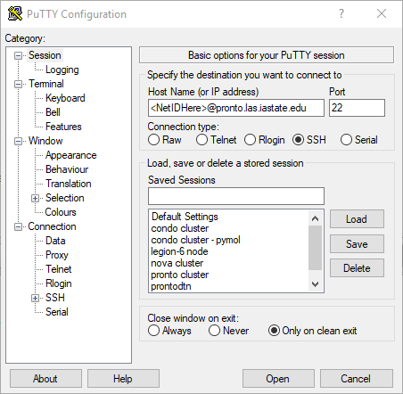
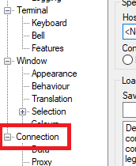
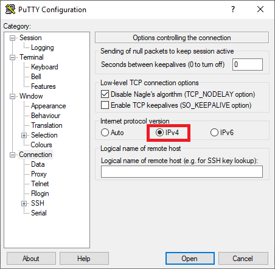

# Advanced Troubleshooting

## Force IPv4 Connections

### For Windows (PuTTY)

In PuTTY's IP address box, type in your NetID followed by Pronto's IP address as you normally would. (Your list of saved sessions may look different)



On the left, click on the _Connection_ category.



Under _Internet protocol version_, select 'IPv4'.



Adjust any other PuTTY settings you normally would use if needed (i.e. X11 Forwarding setup), and click _Open_ to connect back to Pronto.

### For Linux, MacOS, Powershell, Windows Subsystem for Linux

If you are using a regular terminal, simply type in:

```
ssh -4 <YourNetID>@pronto.las.iastate.edu
```

## Disable IPv6 Privacy Mode

If you are using an ISU-owned machine, please contact your local IT support to do this step.

### Windows

Open up PowerShell (run as Administrator) and run the following commands:

```
Set-NetIPv6Protocol -RandomizeIdentifiers Disabled
Set-NetIPv6Protocol -UseTemporaryAddresses Disabled
```

You may need to reboot before this change is effective.

### Linux

Open a terminal and run:

```
sudo sysctl -w net.ipv6.conf.all.use_tempaddr=0
```

To make this change persist between reboots, perform the following steps:

Open /etc/sysctl.conf in your favorite editor. If the file is non-existent a new, blank file will be created.

```
sudo nano /etc/sysctl.conf
```

At the end of the file, add the following line:

```
net.ipv6.conf.all.use_tempaddr=0
```

Save and exit.

At any time you can verify the state of this setting with:

```
sysctl net.ipv6.conf.all.use_tempaddr
```

which should return: `net.ipv6.conf.all.use_tempaddr = 0`

### macOS

Open a terminal and run:

```
sudo sysctl -w net.inet6.ip6.use_tempaddr=0
```

To make this change persist between reboots, perform the following steps:

Open /etc/sysctl.conf in your favorite editor. If the file is non-existent a new, blank file will be created.

```
sudo nano /etc/sysctl.conf
```

At the end of the file, add the following line:


```
net.inet6.ip6.use\_tempaddr=0
```

Save and exit.

At any time you can verify the state of this setting with:

```
sysctl net.inet6.ip6.use_tempaddr
```

which should return: `net.inet6.ip6.use_tempaddr: 0`