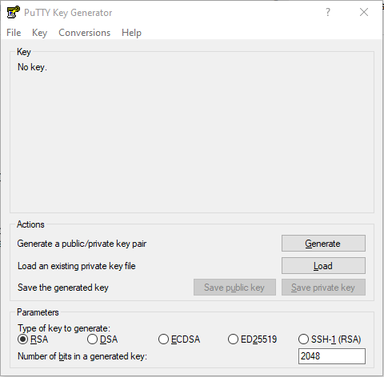

# How to Generate SSH Keys

## What are SSH keys?

SSH supports a number of methods to authenticate a user. You're probably familiar with password based authentication, where you provide your netid username and password to get in. Public key authentication is a bit different. Instead of a password, you prove your identity using a key that you've previously told the server to trust.

## Generating keys

The method by which one generates keys differs from OS/client. Our servers support just about any key type that you could want, but we generally recommend at least 4096bit RSA or ED25519.

### PuTTY

You'll need to use the puttygen tool. Make sure to select either RSA (if you do, change the number of bits to 4096) or ED25519



After setting the key type (RSA or ED25519) and the number of bits, click 'Generate'. It might take a few seconds.

Finally, you'll need to save your key. The key is in two parts: a private key and a public key. Make sure you click the save button for each part.

### OpenSSH (BSD, MacOS, Linux, Windows10)

OpenSSH is the command line ssh/sftp/scp client baked into \*BSD, Linux, MacOS, and recently Windows 10. If you happen to already have a keypair (ie the location (homedir)/.ssh/id\_rsa already exists, or you have a keypair elsewhere) feel free to reuse it here.

To generate a key with OpenSSH, use ssh-keygen:

```
ssh-keygen -t rsa -b 4096
```

This will generate a 4096 bit RSA keypair and (by default) put it in the (homedir)/.ssh/id\_rsa location, you can change where it goes at the prompt or specify `-f <location>` in the command line invocation. By default the client will look at .ssh/id\_rsa so if you don't want to have to tell ssh where to find the key you can keep the default location. You'll also be asked to set a password to protect the key if you want. This isn't necessary, but is recommended.

If you want to use ED25519 instead

```
ssh-keygen -t ed25519
```

Using the keys
--------------

### Adding keys to the server

You'll need to get the contents of your public key. For OpenSSH keys this is as easy as copying the contents from the .pub file for the key (if you're using .ssh/id\_rsa this key will be .ssh/id\_rsa.pub) this'll look a lot like:

```
ssh-rsa <a bunch of characters here>
```

you'll need to copy that entire single line, and it is a single line, to /home/<username>/.ssh/authorized\_keys on the server. That file should contain one public key per line.

If you're on BSD/Linux/MacOS you can use the ssh-copy-id command to handle the creation of this file on the server and copying the keys automatically.

```
ssh-copy-id -i path/to/key/file username@server.las.iastate.edu
```

For keys generated with putty you'll need to load the key you created with puttygen and then copy the public key that it'll display.

### Adding the keys to your client

### PuTTY

Open the key with pageant. Just double clicking the key in explorer is usually enough, enter your password if you set one. Then just connect as you would normally through PuTTY.

### OpenSSH

You've got a few options. If you've got the key in the default location ~/.ssh/id\_rsa the client will attempt to use that key by default without any change on your part. Just:

```
ssh username@server.las.iastate.edu
```

and you're good. If you put a password on it, you'll be prompted for the password for the key.

If you're going to be using the key a lot, or you've got your key in a non-standard location you can use the ssh-agent.

Usually the agent is already running, so you can just do:

```
ssh-add path/to/key/file/here
```

which will add the key to the agent. If you password protected the key, you'll need to enter the password to add the key to the agent. Once you've done this you'll be able to use scp, sftp, and ssh without being prompted for the key password.

You may need to manually start the ssh-agent. How to do this differs based on your environment. For BSD/Linux from bash:

```
eval $(ssh-agent)
```

will start ssh-agent and set the variables necessary to use it in your shell

For windows you'll need to make sure the ssh-agent service is running. This requires administrator permissions, so ask your IT professional for help.