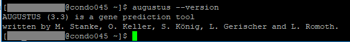
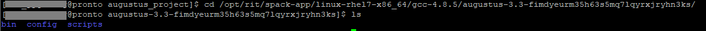
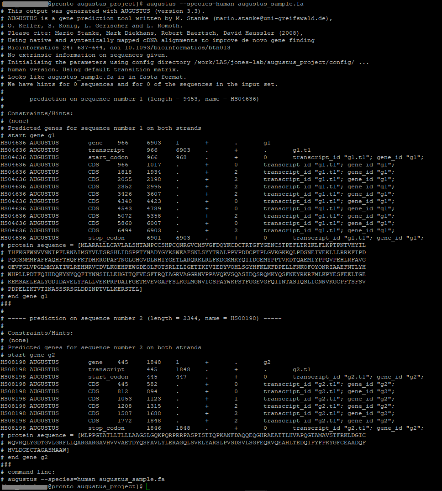

# Augustus

Augustus is a eukaryotic gene prediction tool. It is also a dependency for [Busco](busco.md) and [Braker](braker.md). You can find more information about it [here](http://bioinf.uni-greifswald.de/augustus/) and the source code along with extra documentation can be found [here](https://github.com/Gaius-Augustus/Augustus/blob/master/docs/RUNNING-AUGUSTUS.md).

In the cluster, create or navigate to a working directory you want to use Augustus in. Run the following:

```
module load augustus/3.3-py2-cuda9-openmpi3-fimdyeu
```


Verify that we have augustus available for us.

```
augustus --version
```


If you see something like this, then Augustus is available.



We will need to grab a copy of the config file for Augustus from the cluster. Type in:

```
whereis augustus
```


And you should get an output like this:

```
augustus: /opt/rit/spack-app/linux-rhel7-x86_64/gcc-4.8.5/augustus-3.3-fimdyeurm                                                                                    35h63s5mq7lqyrxjryhn3ks/bin/augustus
```


We need to navigate to the parent directory of augustus

```
cd /opt/rit/spack-app/linux-rhel7-x86_64/gcc-4.8.5/augustus-3.3-fimdyeurm35h63s5mq7lqyrxjryhn3ks/
```


We can see that there are three folders here named bin, config and scripts.



The config folder is what we will be needing. Copy that folder into your working directory by using the following command: 

```
cp -r config <YourWorkingDirectoryHere>
```

You may have to wait a while until this completes. 

Now that we have our config file in our working directory, we need to set the environment variable for Augustus. You will need to run the following command:

```
export AUGUSTUS_CONFIG_PATH=<YourWorkingDirectory>/config/
```


For our data, Augustus requires two arguments that are DNA sequences. These sequences must be in fasta (.fa) format. 

You can find a sample fasta file to run [here](https://github.com/Gaius-Augustus/Augustus/blob/master/examples/example.fa).

To run Augustus, you can use the command below and fill in the parameters you desire:

```
augustus [optional parameters] --species=[SPECIES NAME HERE] example.fa
```


If you want to export the output to another file, add a pipe operator at the end of the command. (e.g. "> output.gff")

For a complete list of species for the "SPECIES NAME HERE" parameter and additional flags you can find it [here](https://github.com/Gaius-Augustus/Augustus/blob/master/docs/RUNNING-AUGUSTUS.md#basic-usage).

In my example, I have ran the command: 

```
augustus --species=human augustus_sample.fa
```


I have also used the example fasta file linked earlier. 

Here is what your output should look like:



Congratulations! You have learned how to run Augustus.