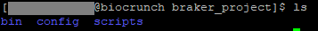
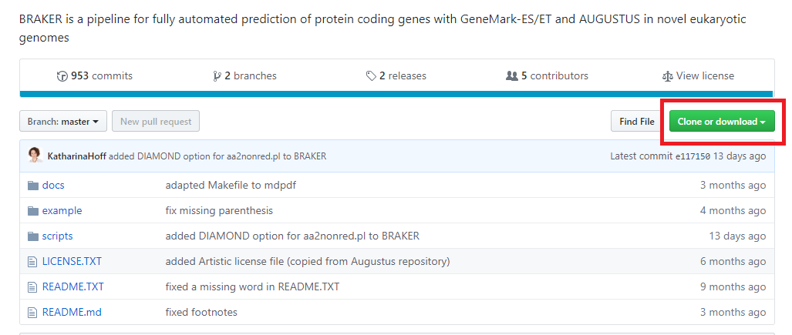
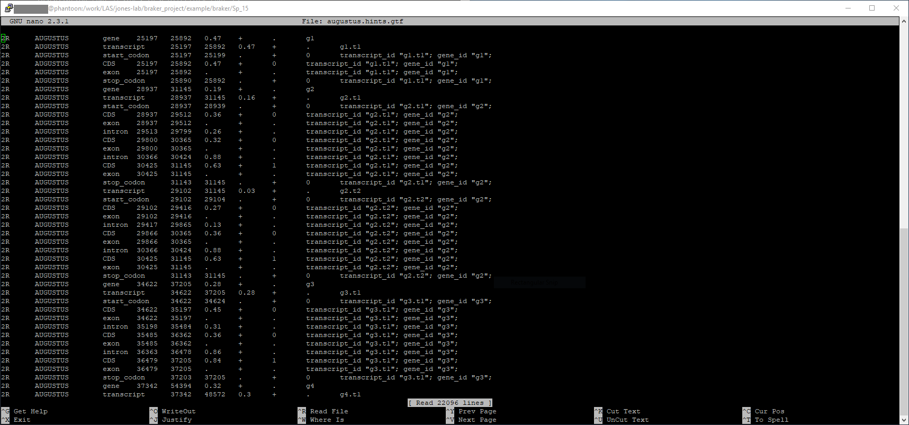

# Braker

Braker is a program for performing gene annotation, and you can find more info about it here: [https://github.com/Gaius-Augustus/BRAKER](https://github.com/Gaius-Augustus/BRAKER)

This program could take hours to run and it is likely you do not want to lose your data in case your connection gets interrupted. It is recommended you use the _screen_ commands. Please refer to [this guide](../interactive_computing/screen.md) if you are not familiar with them. 

### Prerequisites

You need to have a key file for Genemark in your home directory.  You can copy the file from the module directory using the following method:

```
module load genemark-et
which gmhmme3
```

output:

```
/opt/rit/spack-app/linux-rhel7-x86_64/gcc-4.8.5/genemark-et-4.38-63ipkx4mydxxqjna5qxukb4vk6eanao6/bin/gmhmme3
```

Then use that path to run

```
cp /opt/rit/spack-app/linux-rhel7-x86_64/gcc-4.8.5/genemark-et-4.38-63ipkx4mydxxqjna5qxukb4vk6eanao6/bin/gm_key ~/.gm_key
```


Braker depends on [Augustus](augustus.md), which makes some assumptions that aren't correct in our environment (such as having write access into the directory where Augustus is installed).  To overcome this, you should copy the Augustus config directory in your working directory, and let Augustus know where it is via the AUGUSTUS\_CONFIG environment variable. 

First, we need to load the Augustus module:

```
module load augustus/3.3-py2-cuda9-openmpi3-fimdyeu
```

Next, navigate to where Augustus is located. Type in "whereis augustus", and it should output the directory for it. 

```
whereis augustus
```

output:

```
/opt/rit/spack-app/linux-rhel7-x86_64/gcc-4.8.5/augustus-3.3-fimdyeurm35h63s5mq7lqyrxjryhn3ks/bin/augustus
```

Navigate to this directory, but omit everything after /bin/. 

On top of the config file, we also need the bin and scripts folders in our working directory to run Braker. 

Copy the folders into your working directory: 

```
cp -r bin <YourWorkingDirectoryHere>  $ cp -r config <YourWorkingDirectoryHere>  $ cp -r scripts <YourWorkingDirectoryHere>
```

Verify that these three files are in your working directory. 



Now we will need to specify the environment variables for Augustus. Use the following commands: (Again, modify file paths if necessary)

```
export AUGUSTUS_CONFIG_PATH=/work/LAS/jones-lab/braker_project/config
export AUGUSTUS_BIN_PATH=/work/LAS/jones-lab/braker_project/bin
export AUGUSTUS_SCRIPTS_PATH=/work/LAS/jones-lab/braker_project/scripts
```

We need to specify the environment variable for Bamtools. Type in "which bamtools" and you should see something like this:

```
/opt/rit/spack-app/linux-rhel7-x86_64/gcc-4.8.5/bamtools-2.5.1-mgm42roept4w23rpc6nnqbf76kpcncur/bin/bamtools
```

Double check that you have omitted the "bamtools" portion in the filepath, otherwise you will get an error saying that it is not an executable. Now type in: (note that the filepath ends in /bin/, not /bamtools/)

```
export BAMTOOLS_PATH=/opt/rit/spack-app/linux-rhel7-x86_64/gcc-4.8.5/bamtools-2.5.1-mgm42roept4w23rpc6nnqbf76kpcncur/bin/
```


Lastly, we need to specify NCBI BLAST+'s environment variable for Braker. 

```
export BLAST_PATH=/opt/rit/spack-app/linux-rhel7-x86_64/gcc-4.8.5/ncbi-rmblastn-2.6.0-2kyyml7fqw6lcrujan2n3xd37srk3sa2/bin/
```

For the purposes of this guide, we will be running a provided example dataset for Braker. 

Download [this repository](https://github.com/Gaius-Augustus/BRAKER) as a zip file and take note of where you download it. We will not be needing all of the files. (You can also clone this repository if you are familiar with git)



Unzip the folder. Now we need to grab two things from this repository:

*   The entire "example" folder 
*   The braker.pl file (Located in the scripts folder)

We will also need a .bam file in order to run Braker. You need to download it from [here](http://bioinf.uni-greifswald.de/bioinf/braker/RNAseq.bam). (It will automatically download as soon as you click the link)

Now that you have these files you will need to upload these files from your local directory to your working directory on the cluster. If you are on Windows, you can use [FileZilla](https://filezilla-project.org/) or [WinSCP](https://winscp.net/eng/download.php). WinSCP is available in the Software Center. On Mac OS X/Linux, you can use the [scp](http://www.hypexr.org/linux_scp_help.php) command to move the files. 

The example folder should be in the same directory as where you placed your bin, scripts and config folders for Augustus. In the example folder, you should place the braker.pl and RNAseq.bam file inside it. Your Genemark key should also be in this directory. 

You will need to specify the path for Genemark: 

```
export GENEMARK_PATH=/opt/rit/spack-app/linux-rhel7-x86_64/gcc-4.8.5/genemark-et-4.38-63ipkx4mydxxqjna5qxukb4vk6eanao6/bin/gmes_petap.pl/
```

(The path must end in "gmes\_petap.pl", if you do not include the ".pl" portion you will get stuck at "Executing gmes\_petap.pl" in your log file!)

Finally, we need Perl and Braker's modules in order to run the script you just downloaded. Run the commands: 

```
module load perl-file-homedir/1.004-gyhgkuq
module load braker/2.1.2-py3-openmpi3-75wblif
```


## Running Braker

There are multiple ways of running Braker. This guide will not go too in-depth on all these methods, but you can find a complete list of ways to run Braker in this [guide](https://github.com/Gaius-Augustus/BRAKER#running-braker). 

Before running, you want to make sure that the node you are using is configured to run longer than the estimated time for each command. For example, if one command takes about 120 minutes to run, you may want to add an extra 30 minutes or an hour just to be safe. A complete list of commands with their runtime can be found [here](https://github.com/Gaius-Augustus/BRAKER#testing-braker-with-rna-seq-data). 

I am going to test Braker by running this command: 

```
braker.pl --genome=genome.fa --bam=RNAseq.bam`
```

This command will take over three hours to run, so please be patient.

If you want to check the status of your job, you can open up another terminal session and navigate to the directory where the log file is. The directory should be specified right after you run the "braker.pl... " command.  For example, I am running my job on Pronto, and I have another session on Prontodtn with the log file open. The log file is named "braker.log" and you should find it at this file location: 

 `/work/LAS/jones-lab/braker_project/example/braker/Sp_1/braker.log`

If you run into any issues, it will most likely be that you did not specify the environment variable path (e.g. AUGUSTUS\_CONFIG=/...) for a specific dependency. Braker tries to guess where its dependencies are located, and by default it will find it within the cluster and assume that is its location. However, none of these dependencies are writable, which is why we needed to copy them into our working directory. 

Another thing to note is that after each session, you will need to reload all of the modules and potentially specify the environment variables again. You will need to run every "module load" or "export" command in this guide again in order use Braker again. 

When your job is done, you might see an error saying:

```
srun: Force Terminated job 70645
srun: Job step aborted: Waiting up to 32 seconds for job step to finish
srun: error: speedy: task 0: Killed
```


This just means that the job scheduler finished your job based on how much time you allocated to it. What matters is what our braker.log file says.

 The end of your braker.log file should look like this:

```
# Wed Jun 19 13:31:37 2019: Running AUGUSTUS with hints for file /work/LAS/jones-lab/braker_project/example/braker/Sp_15/genome.fa
/work/LAS/jones-lab/braker_project/bin/augustus --species=Sp_15 --AUGUSTUS_CONFIG_PATH=/work/LAS/jones-lab/braker_project/config --extrinsicCfgFile=/work/LAS/jones-lab/braker_project/scripts/cfg/rnaseq.cfg --alt$

# Wed Jun 19 14:00:49 2019: Making a gtf file from /work/LAS/jones-lab/braker_project/example/braker/Sp_15/augustus.hints.gff
cat /work/LAS/jones-lab/braker_project/example/braker/Sp_15/augustus.hints.gff | perl -ne 'if(m/\tAUGUSTUS\t/) {print $_;}' | perl /work/LAS/jones-lab/braker_project/scripts/gtf2gff.pl --printExon --out=/work/LA$

# Wed Jun 19 14:00:49 2019: AUGUSTUS prediction complete
# Wed Jun 19 14:00:49 2019: Making a fasta file with protein sequences of /work/LAS/jones-lab/braker_project/example/braker/Sp_15/augustus.hints.gtf
/opt/rit/spack-app/linux-rhel7-x86_64/gcc-4.8.5/python-3.6.3-u4oaxsbnvbz6s7yxztqvvirlipfjrnx7/bin/python3 /work/LAS/jones-lab/braker_project/scripts/getAnnoFastaFromJoingenes.py -g /work/LAS/jones-lab/braker_pro$

 

# Wed Jun 19 14:00:51 2019: deleting empty files
# Wed Jun 19 14:00:51 2019: find /work/LAS/jones-lab/braker_project/example/braker/Sp_15 -empty

...

```


Our job is complete! Braker will create a couple of output files in our working directory. 

As the log file mentions, one of our results are in a fasta file. My fasta (.fa) file is located here:

```
/work/LAS/jones-lab/braker_project/example/braker/Sp_15/augustus.hints.gtf
```




Your other output files should look similar to what's in the picture above. For a more detailed explanation for each these files contain, please refer to this [link](https://github.com/Gaius-Augustus/BRAKER#output-of-braker).

Congratulations! You have successfully learned how to run Braker!