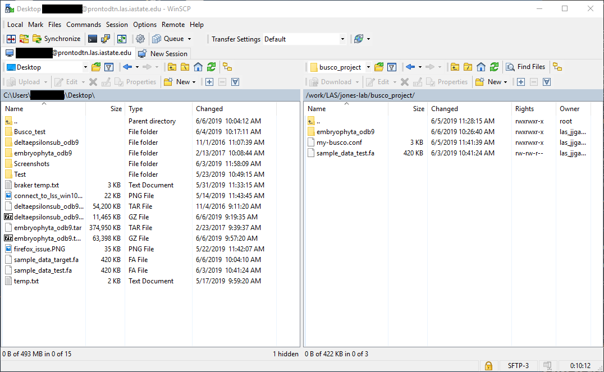
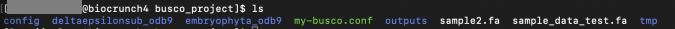

# Busco

In this guide, we will discuss how to run and configure Busco (Benchmark Universal Single Copy Orthologs). You can find information about Busco [here](https://busco.ezlab.org/).

Once you have accessed the cluster, we need to load the modules and dependencies for Busco. Once you have accessed a single node with your desired configurations, navigate to your working directory or create one. Next, use the following commands:


```
module load busco/3.0.1-py2-cuda9-openmpi3-ze7lkie

module load augustus/3.3-py2-cuda9-openmpi3-fimdyeu

module load blast-legacy/2.2.26-d2blzkd

module load hmmer/3.1b2-cuda9-openmpi3-4ab6zzt

module load r/3.4.3-py2-kaltwmm

cp /opt/rit/spack-app/linux-rhel7-x86_64/gcc-4.8.5/busco-3.0.1-ze7lkiedvzma2wiiehfdwa7usmcgk5wi/config/config.ini.default my-busco.conf
```


These commands will load all of Busco's dependencies and create a my-busco.conf file, which we will be needing.

Verify that the my-busco.conf file is available in your working directory. 


Now we will find where our dependencies are located. Be sure to take note of these file paths, as we will need them for later. To find these dependencies, type in the following commands: 


```
whereis augustus

whereis etraining

whereis makeblastdb

whereis tblastn

whereis hmmsearch

whereis Rscript
```


Now that we have the filepaths of all Busco's dependencies, we can go into the my-busco.conf file and modify it. We need to edit the my-busco.conf file. You can type in the following command to edit the config file: 


```
nano my-busco.conf
```


(Alternatively if you can use vim if you prefer)


Using the arrow keys, keep going down and until you see the filepaths for all of Busco's dependencies. It should look like this:


Using the file paths that we saved, we need to modify the default path of these dependencies. Copy and paste the file paths you saved from earlier for each dependency. Specifically for augustus, etraining, makeblastdb, tblastn, hmmsearch and Rscript, be sure to exclude their name from the file paths. The file path should end in /bin/. In the gff2gbSmallDNA.pl, new\_species.pl and optimize\_augustus.pl paths, use etraining's file path except replace everything after /bin/ with /scripts/. 

Below is what this portion of your .conf file should look like.


```
[tblastn]
# path to tblastn
path = /opt/rit/spack-app/linux-rhel7-x86_64/gcc-4.8.5/blast-plus-2.6.0-n35bbshlmxq65oe26vjpyaeinvolt5u6/bin/

[makeblastdb]
# path to makeblastdb
path = /opt/rit/spack-app/linux-rhel7-x86_64/gcc-4.8.5/blast-plus-2.6.0-n35bbshlmxq65oe26vjpyaeinvolt5u6/bin/

[augustus]
# path to augustus
path = /opt/rit/spack-app/linux-rhel7-x86_64/gcc-4.8.5/augustus-3.3-fimdyeurm35h63s5mq7lqyrxjryhn3ks/bin/

[etraining]
# path to augustus etraining
path = /opt/rit/spack-app/linux-rhel7-x86_64/gcc-4.8.5/augustus-3.3-fimdyeurm35h63s5mq7lqyrxjryhn3ks/bin/

# path to augustus perl scripts, redeclare it for each new script
[gff2gbSmallDNA.pl]
path = /opt/rit/spack-app/linux-rhel7-x86_64/gcc-4.8.5/augustus-3.3-fimdyeurm35h63s5mq7lqyrxjryhn3ks/scripts/
[new_species.pl]
path = /opt/rit/spack-app/linux-rhel7-x86_64/gcc-4.8.5/augustus-3.3-fimdyeurm35h63s5mq7lqyrxjryhn3ks/scripts/
[optimize_augustus.pl]
path = /opt/rit/spack-app/linux-rhel7-x86_64/gcc-4.8.5/augustus-3.3-fimdyeurm35h63s5mq7lqyrxjryhn3ks/scripts/

[hmmsearch]
# path to HMMsearch executable
path = /opt/rit/spack-app/linux-rhel7-x86_64/gcc-4.8.5/hmmer-3.1b2-4ab6zzt2z5x2xp2osta2cobfb4dbh3b7/bin/

[Rscript]
# path to Rscript, if you wish to use the plot tool
path = /opt/rit/spack-app/linux-rhel7-x86_64/gcc-4.8.5/r-3.4.3-kaltwmmc7x5pobe6lzwecoicwod5ntpm/bin/
```


Up to this point, we have configured and told Busco where our dependencies are. Now we just need to configure a few more options and provide data.

You will need a fasta file (.fa) to serve as our input for Busco. If you do not already have one, you can find one [here](https://gitlab.com/ezlab/busco/blob/master/sample_data/target.fa). To download it, click on the cloud icon on the top right. Take note of the download location. 


You will need a Busco dataset for our lineage path. If you do not have one already, you can get it from [here](https://busco.ezlab.org/). Again, take note of where you download it. 


## Extracting the Datsets

By default, when you download these datasets they will be in tar.gz format. You need to unzip it so that you can access the folder's contents, otherwise Busco will not recognize it. 

If you are on Windows, you can use 7-Zip. It is available for download on the Software Center if you do not have it installed. Otherwise you can download it from [here](https://www.7-zip.org/). Right click on the downloaded tar.gz file and click "Extract here". Repeat this step once again, and you should get be able to access the folder's contents. 


If you are on Mac OS X, you can simply just double click on the file and the folder will be readily available. 


We now have data we can use for Busco​​​​! Now we just need to transfer these files. We need to use the data transfer node, as you cannot transfer data within the cluster. You can read more about the data transfer node [here](pronto).

We will be using pronto's data transfer node below:


```
prontodtn.las.iastate.edu
```

!!! note
    Prontodtn is currently having connection troubles with LSS. Until we work out a solution, please use `biocrunch.las.iastate.edu` for data transfers to and from LSS.

## Transferring to the cluster on Windows

You need to use Filezilla or WinSCP to upload your local files to the data transfer node. WinSCP is available in the Software center. Otherwise the download links are provided below:

Filezilla: [https://filezilla-project.org/](https://filezilla-project.org/)

WinSCP: [https://winscp.net/eng/download.php](https://winscp.net/eng/download.php)

In this example, I will be using WinSCP. When you open up the application, you should be prompted with login credentials. For the host name, please use the pronto data transfer node address listed above. Then, login with your credentials. 


On the left side, navigate to where you downloaded your dataset and fasta files. On the right side, navigate to the root directory (using the dropdown on the top left of the box on the right), then go to your working directory, and find where your my-busco.conf file is located. In my example below, I have the dataset and fasta file located on my desktop. My Busco project is located in /work/LAS/jones-lab/busco\_project. The dataset folder and fasta file are boxed in red below:


You can simply drag and drop the dataset and fasta file into our working directory. Now you should be able to see the files you transferred in your working directory!



## Transferring to the cluster on Mac OS X/Linux

You will need the terminal to navigate to transfer our files. You can simply just open up another terminal session if you have one open already. Navigate to where your fasta file(s) and dataset folder(s) are in your local directory. Once you have navigated to the directory, we will need to run a few commands.

To transfer the dataset folder, use the following command:


```
scp -r <DatasetFolderName> <YourNetID>@prontodtn.las.iastate.edu:/<YourWorkingDirectory>
```


For the fasta file, you can use: 


```
scp FastaFileNameHere.fa <YourNetID>@prontodtn.las.iastate.edu:/<YourWorkingDirectory>
```


In your Busco project, verify that the files have been transferred. In my case, I had a dataset named "deltaepsilonsub\_odb9" and a fasta file named sample2.fa transferred to my working directory.


We are almost done! Now we just need to go back to the my-busco.conf file and tell Busco where these two files are along with a few minor additions. Again, you can use "nano my-busco.conf" to edit the config file. Uncomment the semicolons and modify the filepaths to where the files we downloaded are located. The "in" file path should be the file path to our fasta (.fa) file. The out\_path is where your outputs will be stored, you can specify where you want this to be stored (I created a folder called "outputs" in my case). The lineage\_path is the filepath to where the dataset folder is. Below is an example of what my config file looks like:


Now we need to specify an Augustus config path. Busco needs a **modifiable** Augustus config file, and we cannot do that with the cluster. Therefore, we need to copy the AUGUSTUS config file from the cluster into our directory. 

We need to know where Augusutus is located: 


```
whereis augustus
```

output:
```
/opt/rit/spack-app/linux-rhel7-x86_64/gcc-4.8.5/augustus-3.3-fimdyeurm35h63s5mq7lqyrxjryhn3ks/bin/augustus
```

The config file is not located here. Omit the "bin/augustus" part and navigate to that directory. You should see 3 folders named bin, config and scripts. We want to copy the config folder. To do so, we need use the "scp" command: 


```
cp -r config <YourWorkingDirectoryHere>
```


This will recursively copy all the files and subfolders within the config file. Please note that we are using prontodtn to copy the files into our working directory. While the files are being copied, you will see a long list of files being uploaded. 


Go back to your working directory and verify that the config folder is available.



We are almost done! Now we just need to specify where the Busco and Augustus config files are. The config folder you just copied belongs to AUGUSTUS, while the my-busco.config belongs to Busco. Run the following commands:


```
export BUSCO_CONFIG_FILE=/<YourWorkingDirectory>/my-busco.conf
export AUGUSTUS_CONFIG_PATH=/<YourWorkingDirectory>/config
```


Note that if you are getting a "No section \[busco\] found" error, you may need to double check your working directory location in the export BUSCO\_CONFIG\_FILE.  

## Running Busco

Before running, please ensure that you have the following:

*   You have a modifiable config file for Augustus, copied from the cluster
*   Dataset(s) in your working directory
*   A modified my-busco.conf file that has the correct file paths for all of Busco's dependencies
*   A folder to hold all your outputs/data (Optional, but recommended)
*   Fasta (.fa) file(s) that you wish to use

Then you can run Busco by typing in the following: 


```
run_BUSCO.py
```


(For a complete list of Busco flags and parameters, you can add the "--help" flag)

  
When Busco is done running, it will tell you where your results are written. They should be the same directory you specified in the my-busco.conf file and it will create another folder. Navigate to that directory and you should have access to your results!

Please note that you will need to run the module load commands again every time you login to the cluster. Be sure **not** to run the "cp /opt/rit/spack-app/linux-rhel7-x86\_64/gcc-4.8.5/busco-3.0.1-ze7lkiedvzma2wiiehfdwa7usmcgk5wi/config/config.ini.default my-busco.conf" command again, otherwise your my-busco.conf will get overwritten.

You have now successfully learned how to run Busco!