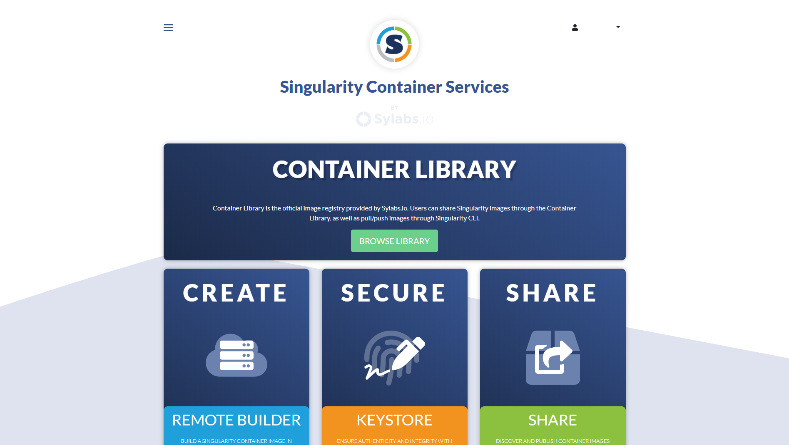
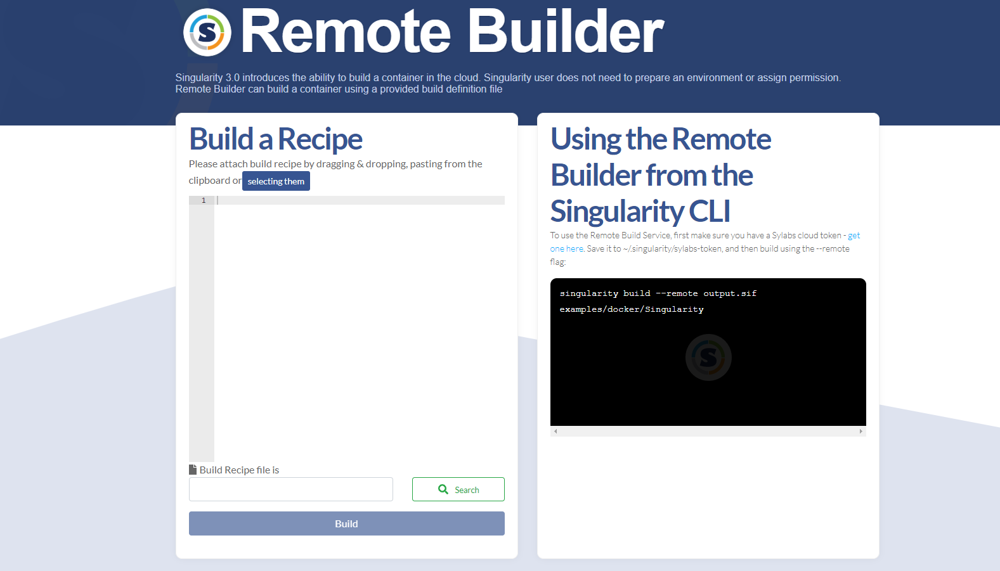
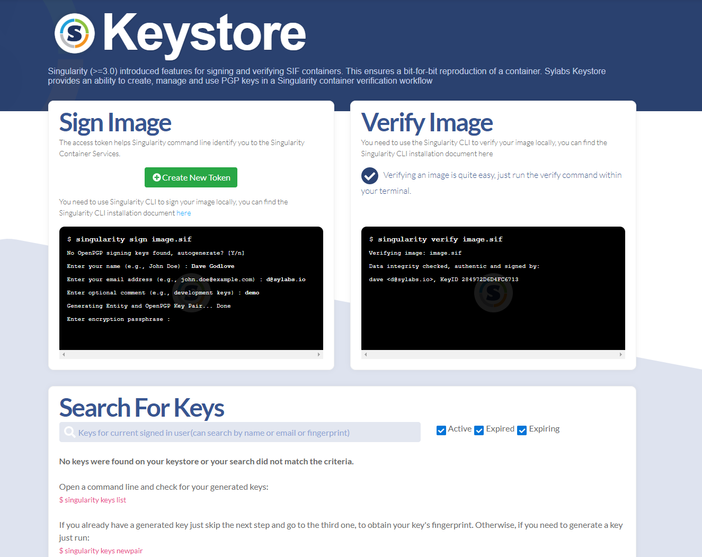
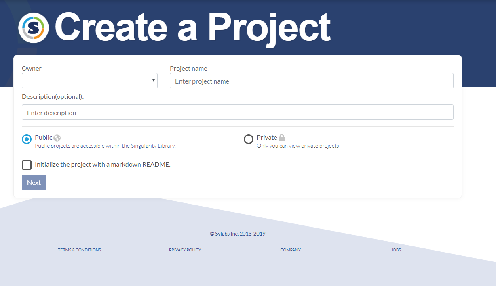
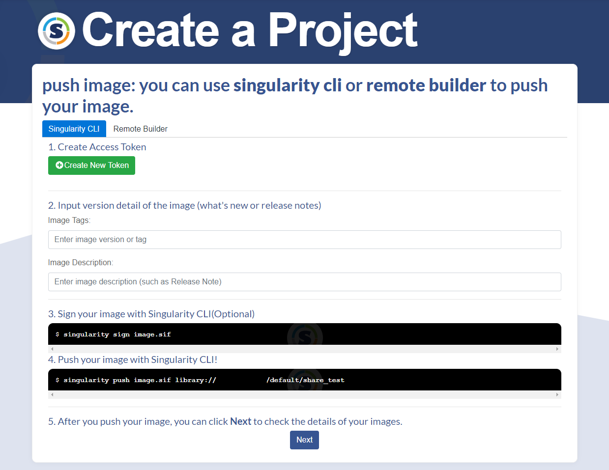

# Private Singularity Image Repositories

Singularity has a private image repository available via the link below:

[https://cloud.sylabs.io/home](https://cloud.sylabs.io/home)

Here you can create, store and share private singularity containers in the cloud. Feel free to create as many projects as you wish, as there is no limit to how many private/public repositories you can have.

To utilize this website, you will first need to sign in. On the top right, select **Sign in to Sylabs** > **Sign in with Google** > Enter your NetID login when prompted (with @iastate.edu). 

You will be redirected to a page similar to this:

## Create a Container

From here, you can choose to create a container image by selecting **CREATE**. This will allow you to build/paste a recipe or use the remote builder from the Singularity CLI.

## Signing or Verifying an Image

To keep your containers and images secure, Sylabs allows you to sign and verify your image. To do this, click on **SECURE**. 

## Sharing your containers

You can share your images by clicking **SHARE**, and you will be prompted to create a project. 

It will prompt you to create an access token and you will be able to add your project's information.

