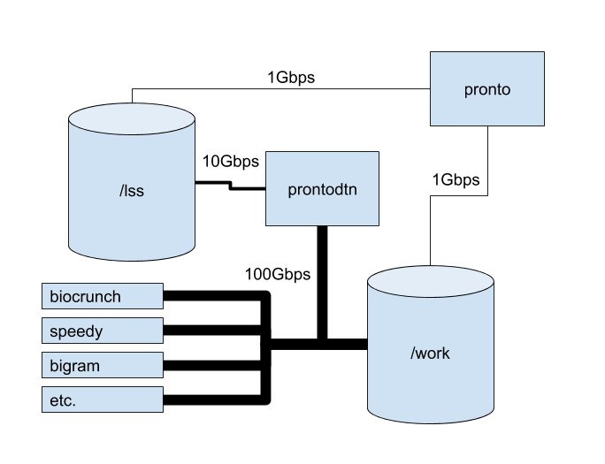

# File Transfers

All file transfers to/from the pronto `/work` directory must be done through the machine:

```
prontodtn.las.iastate.edu
```

!!! note
    Prontodtn is currently having connection troubles with LSS. Until we work out a solution, please use `biocrunch.las.iastate.edu` for data transfers to and from LSS.

You will need to be on campus or connected to the VPN.

This diagram shows the larger capacity network connections on prontodtn, which explains why we require files to be transferred through prontodtn rather than pronto:



The pronto work directories are mounted at `/work` and LSS is mounted at `/lss`.

Several file [transfer methods](transfer_methods.md) are available.

Note: The ISU VPN has limited bandwidth. If you have a large amount of data to transfer, or you want to transfer files without using the VPN, we recommend that you use [Globus](globus.md).

