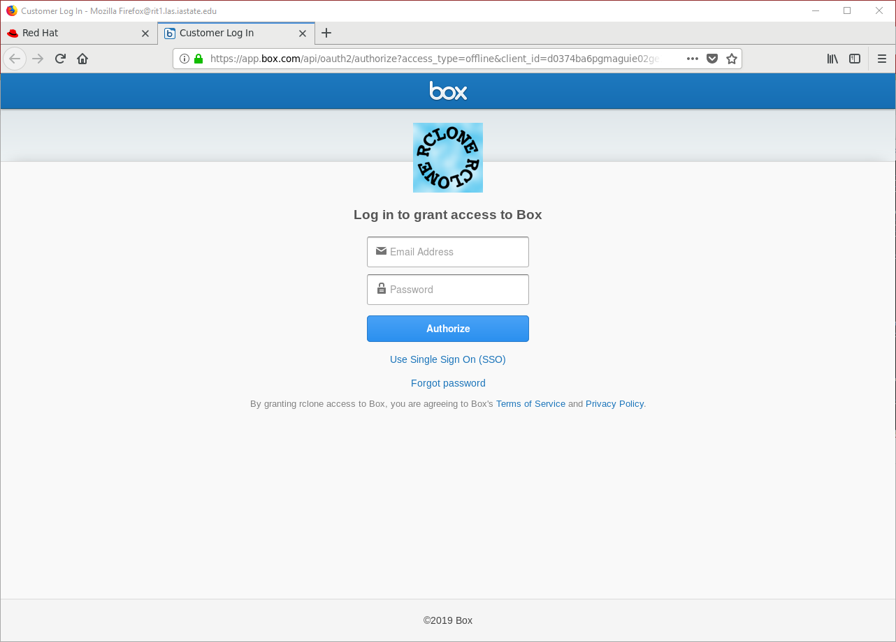
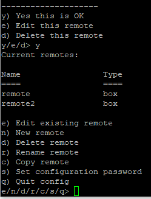

# How to copy files from /work and /lss to Box using rclone

Rclone is similar to the rsync command, except it is used for syncing files/directories for cloud servers such as Google Drive, Box, etc. If you are looking for a guide on rsync, please refer to [this link](rsync.md).

Note that rclone also has many other utilities and you can find a complete list of commands/documentation here: [https://rclone.org/docs/](https://rclone.org/docs/)

## Configuring rclone on prontodtn

Open up a terminal session and connect to prontodtn.

```
ssh yournetid@prontodtn.las.iastate.edu
```

You will need to first create a config file to link your box account. Navigate to your working directory (i.e. /work or /lss), and use the command:

```
rclone config
```

You should see the following, follow along with the prompt given:

```
No remotes found - make a new one
n) New remote
s) Set configuration password
q) Quit config
n/s/q> n
```

```
name> remote
Type of storage to configure.
Enter a string value. Press Enter for the default ("").
```

```
Choose a number from below, or type in your own value
 1 / Alias for a existing remote
   \ "alias"
 2 / Amazon Drive
   \ "amazon cloud drive"
 3 / Amazon S3 Compliant Storage Providers (AWS, Ceph, Dreamhost, IBM COS, Minio)
   \ "s3"
 4 / Backblaze B2
   \ "b2"
 5 / Box
   \ "box"
 6 / Cache a remote
   \ "cache"
 7 / Dropbox
   \ "dropbox"
 8 / Encrypt/Decrypt a remote
   \ "crypt"
 9 / FTP Connection
   \ "ftp"
10 / Google Cloud Storage (this is not Google Drive)
   \ "google cloud storage"
11 / Google Drive
   \ "drive"
12 / Hubic
   \ "hubic"
13 / JottaCloud
   \ "jottacloud"
14 / Local Disk
   \ "local"
15 / Mega
   \ "mega"
16 / Microsoft Azure Blob Storage
   \ "azureblob"
17 / Microsoft OneDrive
   \ "onedrive"
18 / OpenDrive
   \ "opendrive"
19 / Openstack Swift (Rackspace Cloud Files, Memset Memstore, OVH)
   \ "swift"
20 / Pcloud
   \ "pcloud"
21 / QingCloud Object Storage
   \ "qingstor"
22 / SSH/SFTP Connection
   \ "sftp"
23 / Webdav
   \ "webdav"
24 / Yandex Disk
   \ "yandex"
25 / http Connection
   \ "http"
Storage> box
```

```
Box App Client Id.
Leave blank normally.
Enter a string value. Press Enter for the default ("").
client_id>

```

```
Box App Client Secret
Leave blank normally.
Enter a string value. Press Enter for the default ("").
client_secret>

```

```
Edit advanced config? (y/n)
y) Yes
n) No
y/n> n
```

```
Remote config
Use auto config?
 * Say Y if not sure
 * Say N if you are working on a remote or headless machine
y) Yes
n) No
y/n> n
```

```
For this to work, you will need rclone available on a machine that has a web browser available.
Execute the following on your machine:
    rclone authorize "box"
Then paste the result below:
result>
```

To continue past this point, you will need to install rclone on your computer as well.

## Authorizing rclone on your local machine

Please follow the instructions on the rclone website to install rclone on your personal machine

[https://rclone.org/install/](https://rclone.org/install/)

Then in a terminal window, run

```
rclone authorize "box"
```

You will see something like the following

```
$ rclone authorize "box"
If your browser doesn't open automatically go to the following link: http://127.0.0.1:53682/auth
Log in and authorize rclone for access
Waiting for code...
```

Copy this URL into the browser on your local computer. You will see a page like the following. 



Click 'Use Single Sign on' and enter your ISU email address. This will send you to Okta, where you should log in.

After you do that, you should see a page with a message like the following

```
Success!

All done. Please go back to rclone.

```

Back in your terminal on your local machine, you should see a message like this

```
Got code
Paste the following into your remote machine --->
{"access_token":"asdf","token_type":"bearer","refresh_token":"asdf","expiry":"2021-07-22T17:04:40.547812045-05:00"}
<---End paste
```

Copy the text between the arrows to your clipboard.

## Back on prontdtn

Paste the code you received in the previous step into your terminal

```
Log in and authorize rclone for access
Enter verification code> xxxxxxxxxxxxxxxxxxxxxxxxxxxxxxxxxx
```

You can now choose to create, edit or delete the remote if you wish. Next, you can see all the remotes you have created and additional options. As you can see in my example below, I have two remotes named remote and remote2. 



You now have everything configured! If you wish to add another remote, you will have to follow the same procedures as above.

## Using RClone to Copy Files

Rclone has many different commands available for use. You can find a complete list of all of rclone's available commands here: [https://rclone.org/commands/](https://rclone.org/commands/)

For the purposes of this guide, we will only be discussing how to copy the files from /work or /lss to your Box. Here is the syntax for copying files from the working directory to the cluster

```
rclone sync <Source> <RemoteName>:<RemoteDirectoryInBox>
```

Note that the remote name is the name of the remote you specified after running rclone config. In the example above, I have a remote called remote.

### From Pronto to Box

If I wanted to copy a folder called "test-project" from my lab's work directory to a folder called "pronto-backup", I would use this command:

```
rclone sync /work/LAS/jones-lab/test-project remote:/pronto-backup/
```

You can navigate to the CyBox or Google Drive website and verify that your files are where you want them to be.

### From Box to Pronto

If I wanted to copy a folder called "pronto-backup" from Box directory to a folder called "test-project" on Pronto, I would use this command:

```
rclone sync remote:/pronto-backup/ /work/LAS/jones-lab/test-project 
```

You should now be able to access that directory at `/work/LAS/jones-lab/test-project` on Pronto.
