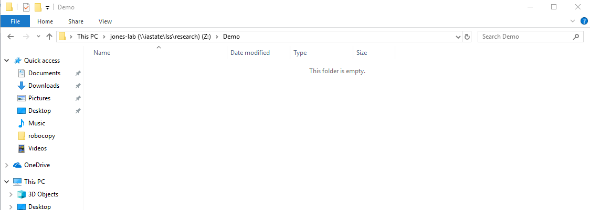

# How to Robocopy to Large Scale Storage
We will discuss how to robocopy (known as "Robust File Copy") files to [Large Scale Storage](https://researchit.las.iastate.edu/guides/lss/) (LSS).  This allows us to copy all the files from destination to another. Robocopy is only available to Windows users and will not work on Mac OS X or Linux. Please refer to [this guide](rsync.md) if you are not a Windows user.

Getting Started
---------------

Begin by clicking start and typing in `cmd`. Press enter, and it should open up the command prompt. Below is the syntax you need to type in for Robocopy: 

```
robocopy <Source folder location> <Destination folder location>  /copy:DT /e
```

(The `/copy:DT` specifies that we want to copy our data with a timestamp to our destination location. The `/e` means that we want to copy the subdirectories, even if it is empty)

If you aren't sure of the exact location where your folder is, you can simply navigate to it using the file explorer, right click on the folder and select properties. You should see something like this below: 


Note that you will need to add `\<name of folder>` after the location (box in red). The name of the folder is boxed in blue.

In my case, the directory of my Test folder is:

```
C:\Users\MyUsername\Desktop\Test
```

Once you have found the source and destination locations, you can run the command as shown earlier. I am going to upload the folder shown above to LSS (which is our destination location). In my case, I mapped it to the Z: drive, and I want to put my files in a folder called "Demo". The location of this folder would be in: 

```
Z:\Demo
```

As you can see, it is initially empty. 



So now that I know the source and destination locations, the command I would run is: 

```
robocopy C:\Users\MyUsername\Desktop\Test /copy:DT /e
```

Please do **not** attempt to use permission flags if you are adding additional ones. 

You should see something like this:


Finally, let's verify that our files have transferred successfully. Navigate to the destination address you specified via the file explorer and check to see if your files are there. Here we can see that my files are in the right location:


You have now successfully learned how to robocopy your files from one location to another!

Additional Information
----------------------

There are additional parameters/flags you can add to your robocopy command. This guide was a straightforward way on how to simply just upload all your files, but you can add a few restrictions if you would like. Again, please do **not** attempt to use permission flags. You can find a complete list of flags and additional options at [https://docs.microsoft.com/en-us/windows-server/administration/windows-commands/robocopy](https://docs.microsoft.com/en-us/windows-server/administration/windows-commands/robocopy)