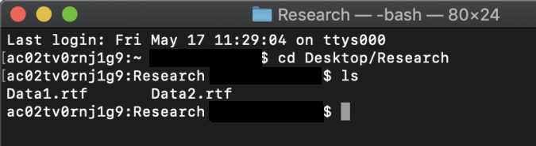
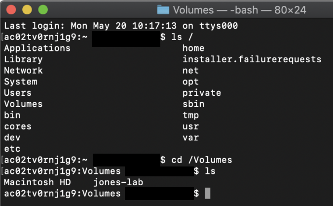
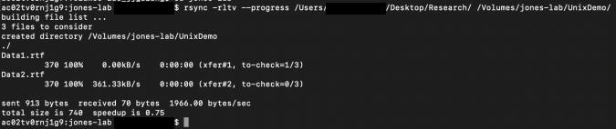

# How to Remote Sync (rsync) to Large Scale Storage

We will discuss how to Remote Sync to [Large Scale Storage](https://researchit.las.iastate.edu/large-scale-storage-lss) (LSS). Note that this guide is only available to Mac OS X or Linux users. If you are currently using Windows, please refer to [this guide](robocopy.md). 

Begin by opening the terminal. If you're on Mac OS X navigate to Finder < Applications < Utilities < Terminal. On Linux, you can right click the desktop and click "Open Terminal".

Verify that rsync is installed
------------------------------

Using the terminal, we need to verify that rsync is installed first. By default, it should be pre-installed on most systems. Type in the following command: 

```
rsync --version
```

You should get an output that tells you the current version you are running on.

If it is not installed, here are the commands you need to run to do so:

For Mac OS X:

```
brew install rsync
```

For Ubuntu/Debian: 

```
sudo apt install rsync
```

For CentOS/Fedora: 

```
sudo yum install rsync
```

Navigating to the files
-----------------------

We need to first navigate to where our files are located. Let's say for example, I had a folder called on the desktop called "Research". If I wanted to navigate to that folder, I would type in the following command:

```
cd Desktop/Research
```

(Note that the D in desktop is capitalized)

Everything after "cd" is the location of where your files are. If I saved a folder under "Downloads", I would type in for example:

```
cd Downloads/<Folder name goes here> 
```


Let's verify that the files we want to sync are in the folder. Type in the command "ls" in the terminal. We should be able to see a list of all the files that are in that folder. In my example, I have created two files called Data1 and Data2. Your terminal should look something like this:



To find the files on your mounted LSS, you need to navigate to the **root** directory. I am doing this demo on Mac OS X, so my mounted LSS would be under "Volumes". For Linux, the location could be different.  So after verifying that my local files are correct, the next command I would type in to get to the **root** directory would be:

```
cd /
```

To begin, type in "ls /" to get an overview of all the files in our file tree. Again, I am using Mac OS X in my example, so your locations may be different. In my case, I would type in "cd /Volumes". You should see the name of your mounted LSS.



If you ever navigate to the wrong location by mistake, you can type in the following command:

```
cd ..
```

This simply allows us to go back a level in the directory. 

We have now successfully navigated to the directory where we want to remotely sync our files. 

Remotely Sync our Files
-----------------------

Now we can begin to remotely sync our files. You do not need to navigate to a specific directory to run this command. 

Here is the syntax for rsync:

```
rsync -rtlv --progress <source location> <destination location> 
```

In my example, I will be syncing files from a folder on my desktop to a folder called UnixDemo on my mounted LSS.

```
rsync -rtlv --progress /Users/MyUsername/Desktop/Research/ /Volumes/jones-lab/UnixDemo/
```



**Important:** When typing in your directories, be sure to follow the trailing slash rules. This can have a significant impact on the files that you are trying to sync. Please refer to this [link](https://unix.stackexchange.com/questions/402555/why-add-a-trailing-slash-after-an-rsync-destination) if you are unsure about these rules.

Please do **not** add the -a flag to your command otherwise you will run into permission failures and other errors. 

Run the command, wait for a bit, and you will have successfully synced your files!