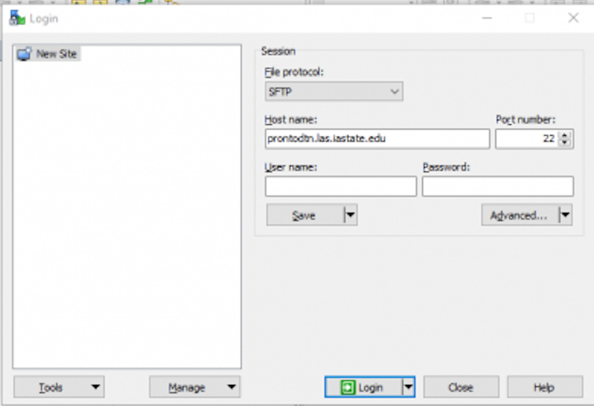
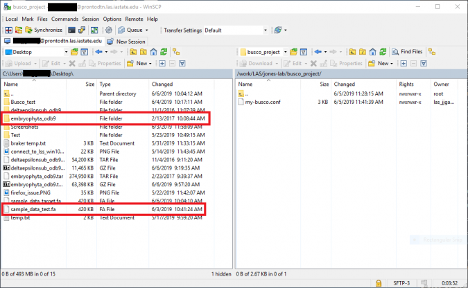
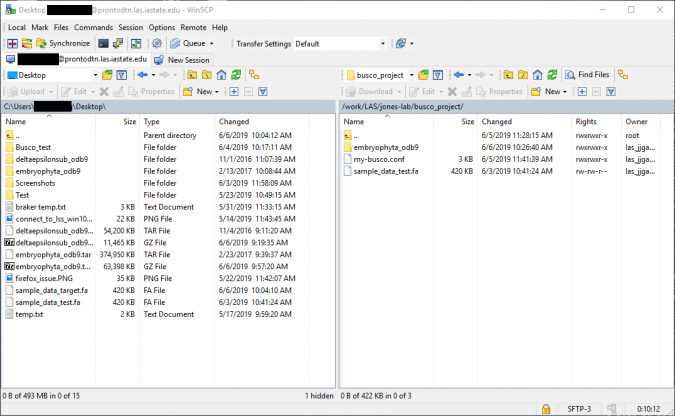

# How to use the SCP (secure copy) command

SCP is a useful command that copies files between hosts on a network. For example, if I wanted to store files on my **local** machine on the **remote** machine(s) (i.e. the clusters), scp would be the command to use on a Mac/Linux terminal. On Windows, you will have to install WinSCP/Filezilla to do it for you. The scp command will **not** work in powershell or command prompt. 

Transferring to/from the cluster on Windows using Filezilla or WinSCP 
----------------------------------------------------------------------

You will need to use Filezilla or WinSCP to upload your local files to the data transfer node on campus. WinSCP is available in the [software](how-use-software-center-windows) center if you are you using a campus computer. If you are using a personal device, the download links are provided below:

WinSCP: [https://winscp.net/eng/download.php](https://winscp.net/eng/download.php)

Filezilla: [https://filezilla-project.org/](https://filezilla-project.org/)

### Log in

When you open up the application, you should be prompted with login credentials. For the _host name_, please use the pronto data transfer node host name:

```
prontodtn.las.iastate.edu
```

Kepe the port number the same and login with your NetID and password. 



After logging in, the left window pane will be your **local** files and the right side will be your **remote** files.

### Transfer files from your computer to the cluster

To move files, drag and drop your files from the **left** window pane to the **right** window pane.





### Transfer files from the cluster to your computer

To move files, drag and drop your files from the **right** window pane to the **left** window pane.

Transferring to the cluster on Mac OS X/Linux
---------------------------------------------

You will need to use the terminal to navigate to transfer your file(s). On Mac, you can simply navigate to Finder < Applications < Utilities < Terminal. For Linux, you could simply right click on the desktop and select _Open Terminal Here_ (This may be different depending on your version installed).

Navigate to the file location of where you want your file(s) to be transferred. If you are unfamiliar with how the Linux File System Structure works, please refer to [this video](https://researchit.las.iastate.edu/video/research-computing-linux-file-system-structure) (On Mac the overall structure is different, but the commands used still apply). Once you have arrived at the location, you will need to use the following commands:

### Get a Kerberos ticket

To use scp, you will first need to ssh to prontodtn.las.iastate.edu. You may be prompted for your password twice. You should enter it both times to ensure that you get a Kerberos ticket. If you are not prompted for it a second time, run

```
kinit
```

After entering your password, you can disconnect from ssh. scp should then work.

### Transfer files from your computer to the cluster

If you wish to transfer an entire folder with its contents (including its subfolders), use this command: 

```
$ scp -r <FolderName> <YourNetID>@prontodtn.las.iastate.edu:/<YourWorkingDirectory>
```

For a single file only, you can use:

```
$ scp <FileName> <YourNetID>@prontodtn.las.iastate.edu:/<YourWorkingDirectory>
```

If this command doesn't seem to do anything, or just hangs, please see the previous section about getting a Kerberos ticket.

When finished, ssh to pronto/prontodtn and navigate to your working directory to verify that your files have successfully transfered.

### Transfer files from the cluster to your computer

If you wish to transfer an entire folder with its contents (including its subfolders), use this command: 

```
$ scp -r <YourNetID>@prontodtn.las.iastate.edu:/<YourWorkingDirectory>/<FolderName> <FolderName>
```

For a single file only, you can use:

```
$ scp <YourNetID>@prontodtn.las.iastate.edu:/<YourWorkingDirectory>/<FileName> <FileName> 
```

When finished, navigate on your computer to <FolderName> or <FileName> on your computer to verify that your files have successfully transfered.

### More examples

For more examples, please refer to this [guide](data-transfer-node-condo) (Note that instead of typing in hpc-class.it.iastate.edu, you will need to use **prontodtn.las.iastate.edu**).

SMB share
---------

If you wish to access your files via SMB share, please contact ResearchIT ([researchit@iastate.edu](mailto:researchit@iastate.edu)) to request access. Once provided, simply enter \\\\prontodtn.las.iastate.edu into your explorer window if you're on Windows, or smb://prontodtn.las.iastate.edu in the finder connect dialog if you're on MacOS.