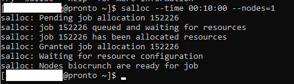
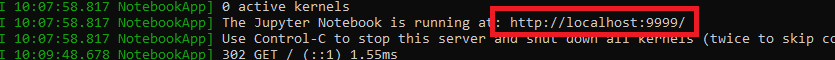
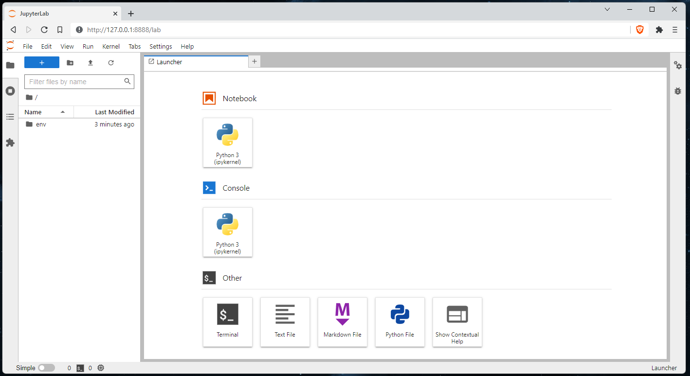
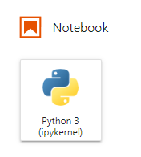
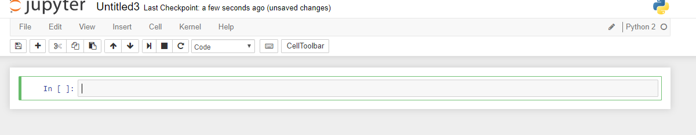
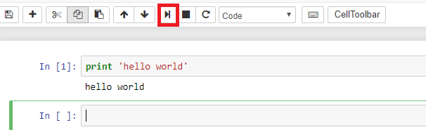

# How to Run Jupyter Notebook

We recommend using [JupyterLab on Open OnDemand.](../ondemand/jupyterlab.md) If that isn't suitable, you can follow this guide.

In this guide we will be discussing how to run Jupyter notebook.  You can learn more about it here: [https://jupyter.org/](https://jupyter.org/)

## Prerequisites

If you are on Mac/Linux, you will just need to use the terminal. For Windows, please use powershell. 

## Connecting to Pronto when using Jupyter

Using Jupyter requires you to connect to an interactive session on Pronto with port forwarding enabled.

Using the terminal, ssh to pronto using: 

```
ssh <YourNetID>@pronto.las.iastate.edu
```

Once you are on pronto, salloc node using: (adjust the time allocated if desired)

```
salloc --time=00:10:00 --nodes=1
```

If you are not familiar with allocating nodes or want to specify other configurations, please refer to [this guide](slurm-basics).

Take note of the node you were assigned. In the screenshot below, the node I was assigned was "biocrunch".



Open up another terminal and ssh to the assigned node. Here you will need to specify a "-L" flag and port numbers. The last 4 digits will be the port number Jupyter will be listening on, so you may need to change it to your needs. If you choose to omit a port number, Jupyter will pick one for you.

```
ssh <YourNetID>@<NodeName>.las.iastate.edu -L <SpecifyPortNumber>:127.0.0.1:<SpecifyPortNumber>
```

In my case, I will choose port 9999. My command would look like

```
ssh jones@biocrunch.las.iastate.edu -L 9999:127.0.0.1:9999
```

(After you connect to your specified node, you may get a benign warning message saying "setsockopt IPV6\_TCLASS 16: Operation not permitted:". This should not cause any issues.)

## Installing Jupyter Notebook

Follow our guide to [create a virtual environment](../python.md) where jupyter notebook will be installed.

Once you have created and activated the virtual environment, run the following to install Jupyter notebook.

```
pip install jupyterlab
```

If you need to use any additional python packages with jupyter, you can install them the same way.

## Running Jupyter Notebook

### Activate the Virtual Environment

If you just installed Jupyter notebook as described above, this part is already done.

If you installed Jupyter notebook previously and want to re-use it with the same Python packages as before, you need to [activate the virtual environment](../python.md) you installed it in.

For example:

```
module load python/3.8.0-k7w5uj4  
source /work/jones-lab/jupyter-virtual-environment
```

Be sure to use the same python module that you used to create the environment. And replace /work/jones-lab ... with the actual path to the directory you created the virtual environment in.

### Start Jupyter Notebook

Run:

```
jupyter lab --no-browser --port 9999
```

Next, open up a browser, and copy the link that was in the terminal and paste it in the browser.



Your browser should look like this:



## Running Python on Jupyter

You can upload your own python code or other files using the "Upload" button on the left hand side. You also have the option of writing and running python code within the browser itself. To create a new python script, click on the Python icon under the Notebook heading_._ 



You will be redirected here:



Now, type in the code that you wish to run. In my example, I will just do a simple hello world program. Once you have typed in your code, you can run the program simply by clicking the "run cell" icon (boxed in red below).



## Troubleshooting

If you attempt to run jupyter-notebook and get a "Permission denied: /run/user/#####", run:

```
unset XDG_RUNTIME_DIR
```

and try again.

## Useful links

This is only a brief tutorial on how to get Jupyter running on pronto, but you can find more extensive documentation here: [https://jupyter.org/documentation](https://jupyter.org/documentation)

Your session may disconnect if you leave it idling for too long. Please refer to [this documentation](http://tljh.jupyter.org/en/latest/topic/idle-culler.html) on how to configure the idle time of your server.

You now know how to run Jupyter notebook!