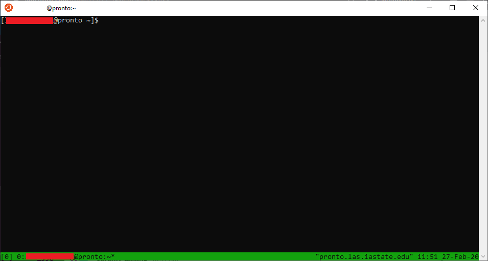
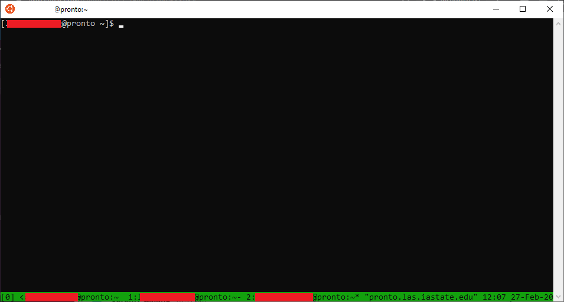

# How to Use tmux

What is tmux?
-------------

Tmux is a terminal multiplexer similar to screen. It allows you to create a session on a remote box, run applications in that remote session, "detach" from the session, and re-"attach" when desired. It also has advanced features such as multiple windows and split views. Using tmux is recommend when running an interactive CLI program remotely. If you get disconnected from your session, you can re-attach as though nothing happened. Alternatively, you can use [the screen command](screen.md) if you do not need multiple terminals.

Basic tmux Usage
----------------

### Create A Session

To create a session, run the command:

```
tmux
```

If you plan to create multiple tmux sessions, you may want to name them by running:

```
tmux new -s <SessionNameHere>
```

This will create a new session. Your terminal should look as it normally does with an extra green line at the bottom -- like this:



### Exit A Session

To exit tmux, type in:

```
exit
```

Note you will still be on pronto, but no longer in a tmux environment.

### Detach From A Session

To detach (meaning exit the window to come back to later) from the tmux session, use **CTRL + b then d** (hold ctrl, press b, let go of both of the keys, and press d). Whatever program(s) you are running in the tmux session will continue going without you.

### Attach (Reattach) To An Existing Session

To re-attach back to a session you've become **detached** from, simply type in:

```
tmux attach
```

Advanced Features
-----------------

### Scroll Back / Copy Mode

In order to scroll back to something off the top or sides of the screen, you need to switch to 'copy mode'. This is done by pressing CTRL + b and then \[. Once enabled, you should see a line offset counter in the upper right corner. The counter shows how many lines back you are.

When done scrolling, you need to return to normal mode. Just press 'q' to exit copy mode.

### Multiple Windows

To create multiple windows, you need at least one tmux session running. You can simply type CTRL + b, let go of both keys and type 'c'. This will open up a new terminal. 



At the bottom, you can see that there are now multiple windows (0, 1, 2) in the session. You can switch between windows using CTRL + b followed by 'n'. The active window is the number wrapped in square brackets ("\[0\]" in this example). You can exit any window by typing 'exit' in the prompt.

Documentation
-------------

A verbose guide on tmux is available at:  
[https://www.linode.com/docs/networking/ssh/persistent-terminal-sessions-with-tmux/](https://www.linode.com/docs/networking/ssh/persistent-terminal-sessions-with-tmux/)

A cheat sheet for tmux users can be found at:  
[https://tmuxcheatsheet.com/](https://tmuxcheatsheet.com/)