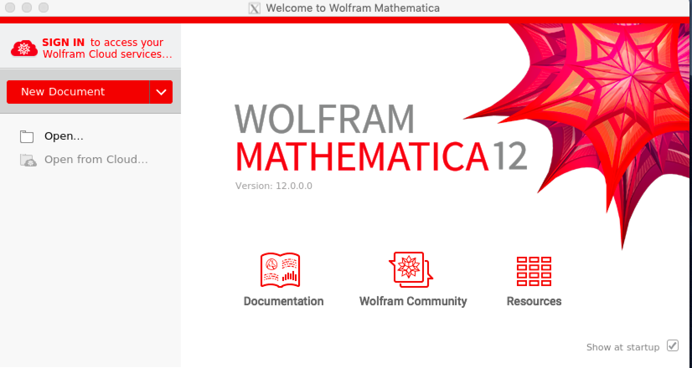
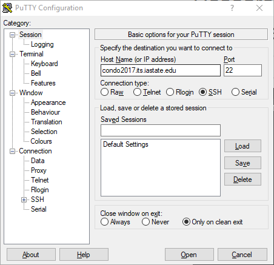
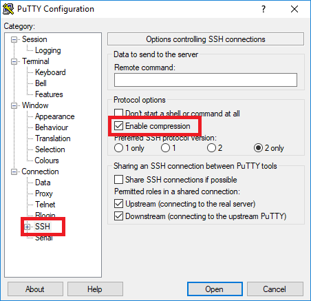
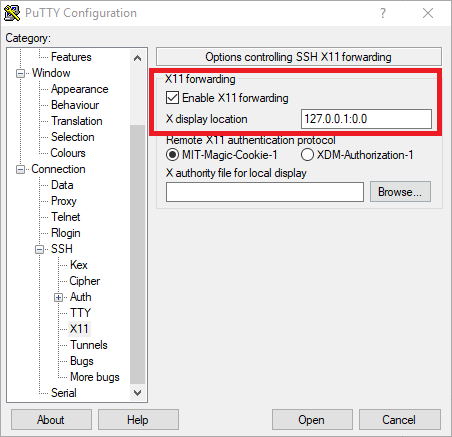
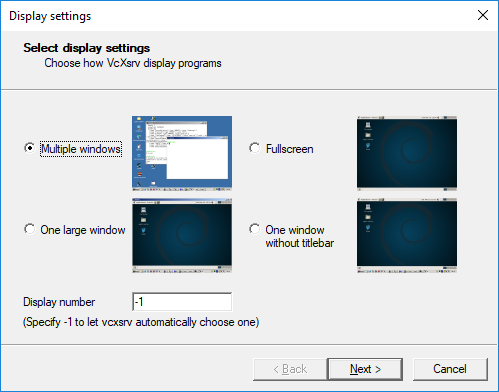
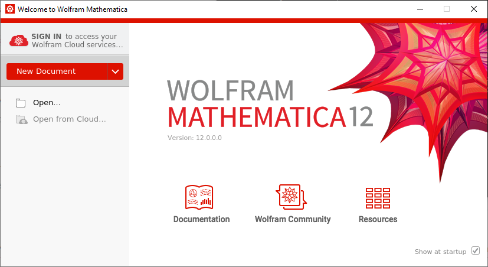

# X Forwarding for Mac and Windows

This guide will explain how to configure and use X-servers for Mac and Windows on Pronto, Condo, and Nova:

* For Mac, use XQuartz
* For Windows, use PuTTY and VcXsrv

If you are connecting from a University owned computer, please install the applications via self-service on , or talk to your departmental IT support person.  If you're on a personally owned device, use the links below: 

* PuTTY: [https://www.chiark.greenend.org.uk/~sgtatham/putty/latest.html](https://www.chiark.greenend.org.uk/~sgtatham/putty/latest.html)
* VcXsrv: [https://sourceforge.net/projects/vcxsrv/](https://sourceforge.net/projects/vcxsrv/)
* XQuartz: [https://www.xquartz.org/](https://www.xquartz.org/)

X Forwarding allows us to run software on Linux/Unix server with a Windows style GUI (Graphical User Interface). 

### Mac OS X

Navigate to Finder > Applications > Utilities. Scroll down until you find XQuartz. Once you find it, click it once and drag it down to the dock at the bottom of the screen. In the dock, right click on XQuartz, hover over Applications and click on Terminal. This will configure XQuartz to run the application we want. 

(If you don't see the Applications > Terminal part, then you may need to open XQuartz once, close it, and you should be able to right click and see these options.) 

Begin by running the following command a terminal: 

```
ssh -X <netid>@pronto.las.iastate.edu
```

Replace `<netid>` with your netid. Note that the `-Y` flag can be used instead of `-X`, but skips X11 security extensions, so only use it if `-X` fails. You will be prompted for your password. (If you're connecting to condo or nova you will also be prompted for your[Google Authenticator](https://www.hpc.iastate.edu/guides/condo-2017/access-and-login) code)

Once you have successfully connected, type in the following (modify as needed for your core count and time limit):

```
srun --x11 --time=01:00:00 --nodes=1 --cpus-per-task=1 --partition=interactive --pty /usr/bin/bash
```

This allows us to use one of the nodes in the cluster. After running this command, you should be assigned a node that you can use.

To test if we have set up X11 forwarding correctly, we try to run mathematica.

Run the following commands:

```
module load mathematica

mathematica
```

You should see something like this:



You now know how to run X Forwarding on Mac!

### Windows

Open PuTTY

By default, PuTTY should have the port set to 22, and connection type should be set to SSH. If neither of these are set, please configure them. 

In the Host Name box, type the name of the cluster you are connecting to, we're using Pronto as the example here:

```
pronto.las.iastate.edu
```

Your PuTTY screen should look like this:



Next, navigate to SSH, and check "Enable compression". (Both are boxed in red)



Expand the SSH tree, click on X11 and check "X11 Forwarding". In the "X display location field, put in the following location:

```
127.0.0.1:0.0
```

This will tell PuTTY to display to VcXsrv's window. 



Click open. You will be prompted to login with your NetID, [Google Authenticator](https://www.hpc.iastate.edu/guides/condo-2017/access-and-login) (if relevant for the system) and your password. 

Now open up VcXsrv (also known as xlaunch) and select a display option. This will simply determine how the program you are trying to run will look on your desktop. In this example, I will choose "Multiple windows".



Keep clicking next and use the default settings. Note that you may not see anything after clicking finish.

Now in PuTTY, type in (modify as needed for your core count and time limit):

```
srun --x11 --time=01:00:00 --nodes=1 --cpus-per-task=1 --partition=interactive --pty /usr/bin/bash
```

This simply allows us to access one of the cluster's nodes. You may need to wait until you have been assigned a node.

Let's test an application to verify that we have setup everything correctly. 

Run the commands:

```
module load mathematica

mathematica
```
You should see something like this:



(You can simply close it normally using the 'X')

Now you can configure and login using X-servers to X Forward on both Windows and Mac!

Please contact us if you have any other questions, at [researchit@iastate.edu](mailto:researchit@iastate.edu)