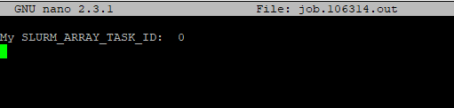

# Job Arrays

Job arrays are meant for submitting or editing a set of jobs that perform a similar function, the only difference being is their index parameters. 

If you are unfamiliar with basics of slurm, please refer to [this guide](slurm_commands.md).

## Sample Script
Below is a sample job script you could follow:

```
#!/bin/bash  
#SBATCH --nodes=1 # request one node  
#SBATCH --cpus-per-task=1  # ask for 1 cpu  
#SBATCH --mem=1G # Maximum amount of memory this job will be given, try to estimate this to the best of your ability. This asks for 1 GB of ram.  
#SBATCH --time=0-00:30:00 # ask that the job be allowed to run for 30 minutes.  
#SBATCH --array=0-6 #specify how many times you want a job to run, we have a total of 7 array spaces

# everything below this line is optional, but are nice to have quality of life things  
#SBATCH --output=job.%J.out # tell it to store the output console text to a file called job.<assigned job number>.out  
#SBATCH --error=job.%J.err # tell it to store the error messages from the program (if it doesn't write them to normal console output) to a file called job.<assigned job number>.err  
#SBATCH --jobname="example job" # a nice readable name to give your job so you know what it is when you see it in the queue, instead of just numbers

# under this line, we can load any modules if necessary

#below this line is where we can place our commands, in this case it will just simply output the task ID of the array  
echo "My SLURM_ARRAY_TASK_ID: " $SLURM_ARRAY_TASK_ID
```

This script will simply create a total of 14 files in your chosen directory, 7 of which will be .out files and 7 will be .err files. You can simply copy and paste this script in a text editor (e.g. notepad++) and save it as "sample.sh". 

To run this script, we first need to place sample.sh in our working directory via scp/Filezilla/WinSCP (WinSCP is available in the [software center](https://researchit.las.iastate.edu/how-use-software-center-windows)). Next, run the command:

```
sbatch sample.sh
```

If I look in my working directory, you will see a total of 14 files have been added:


Let's verify that my script worked, I will type in:

```
nano job.106314.out 
```



As you can see, we got the result we expected. Now if we run the same command on job.106319.out, we would get:


  
You have now successfully learned how to create a slurm job array script.

## Throttling an array of jobs

Say you wanted to wanted to run a job array of size 100, and you only wanted to run 5 at a time. You can simply run the command:

```
sbatch --array [0-99]%5 samplescript.sh
```

The "[0-99]" portion are the indices of the array and the value after the % sign is how many jobs you wish to run at a time. Once you run this, you can immediately check if your jobs are being run by using the command:

```
squeue -u <YourUsername>
```

This will output a list of the jobs you are currently running in real-time.