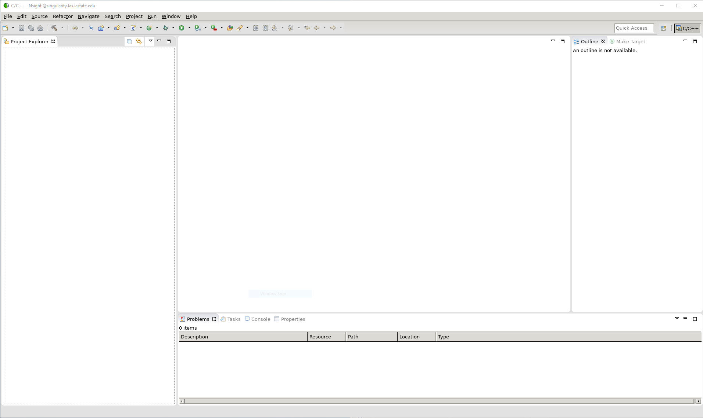

# How to Run Nvidia Nsight

In this guide, we will discuss how to run Nvidia Nsight.

If you wish to learn more about Nvidia Nsight (the GUI version), please visit this link: [https://developer.nvidia.com/nsight-eclipse-edition](https://developer.nvidia.com/nsight-eclipse-edition)

## Prerequisites

There are two available versions of Nvidia Nsight, which include a CLI-based and GUI version. 

For the GUI version, you will first need to understand how X11 Forwarding works. If you are unfamiliar with it, please refer to [this guide](../interactive_computing/x_forwarding.md). You will need to use the terminals that are mentioned in the guide.

If you are using the CLI version:

* Mac/Linux users can simply just use the regular terminal.
* Windows users can use PuTTY/Powershell/[Linux for Windows Subsystem](https://docs.microsoft.com/en-us/windows/wsl/install-win10)

## CLI-Based

To run the CLI-Based version, first you will need to SSH to pronto.

```
ssh <YourNetID>@pronto.las.iastate.edu
```

Allocate a **GPU** compute node (make sure to use the --gres flag). If you are unfamiliar with allocating nodes or wish to change configurations, please refer to [this guide](../job_scheduler/index.md).

```
srun --time=01:00:00 --nodes=1 --cpus-per-task=1 --pty --partition=gpu --gres=gpu:1 /usr/bin/bash
```

Once you have allocated a GPU node, you need to run the following:
```
module load ml-gpu/20220928
ml-gpu bash
export LD_LIBRARY_PATH='/opt/nvidia/nsight-compute/2022.2.1/host/linux-desktop-glibc_2_11_3-x64'
```

Then you can run Nvidia nsight by executing the command:

```
/opt/nvidia/nsight-compute/2022.2.1/nv-nsight-cu-cli <YourCode'sWorkingDirectoryHere>
```

For example, your filepath could look something like:

```
/opt/nvidia/nsight-compute/2022.2.1/nv-nsight-cu-cli /work/LAS/mylab/mycode
```

You now have a working CLI version of Nvidia nsight!

## GUI Version

The GUI version opens up an IDE that allows you to write/run code in real-time. 

First, you will need to start a local X server on your computer. Again, please refer to [this guide](../interactive_computing/x_forwarding.md) if you are not familiar with X11 Forwarding. 

Next, SSH to pronto and salloc a GPU node. In this example we will be using the singularity node for 30 minutes. If you are unfamiliar with this command or want to add different configurations, please refer to the [slurm basics](../job_scheduler/index.md) guide. 

```
salloc --time 00:30:00 --nodelist=singularity
```

Once you have been assigned the GPU compute node, we will need to SSH to it.

Now SSH again to the node that you allocated.

```
ssh -X <YourNetID>@<NodeName>.las.iastate.edu
```

For example, since we allocated singularity, we can use:

```
ssh -X <YourNetID>@singularity.las.iastate.edu
```

Once you've been placed on the allocated compute node, run the following commands:

```
module load ml-gpu/20220928

ml-gpu bash

export LD_LIBRARY_PATH='/opt/nvidia/nsight-compute/2022.2.1/host/linux-desktop-glibc_2_11_3-x64'

/opt/nvidia/nsight-compute/2022.2.1/nv-nsight-cu
```

This will open up another window with Nvidia nsight. It will prompt you to choose a workspace directory. Once you select your workspace directory, your window will look like this:



You now have a working GUI version of Nvidia nsight!