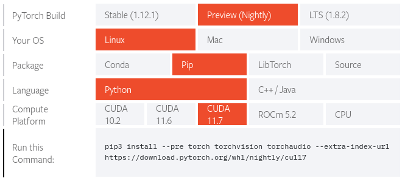

# How to upgrade existing Python packages

To upgrade existing packages in the container, you will need to get an interactive session on a GPU node.

```
srun --time=01:00:00 --nodes=1 --cpus-per-task=4 --partition=gpu --gres=gpu:1 --pty /usr/bin/bash
```

Load the version of the ml-gpu module you want to use. For example:

```
module load ml-gpu/{{ recommended_mlgpu_version() }}
```

Next, create a directory to install the upgraded packages to. This should be within your group's /work directory, and specific to the version of the ml-gpu container that you're using.

```
ml-gpu python -m venv --system-site-packages /work/LAS/your-lab/mlgpuvenv-{{ recommended_mlgpu_version() }}
```

Now you can upgrade the packages with pip.

```
ml-gpu /work/LAS/your-lab/mlgpuvenv-{{ recommended_mlgpu_version() }}/bin/pip3 install --upgrade somepackage
```

To confirm the packages are upgraded:

```
ml-gpu /work/LAS/your-lab/mlgpuvenv-{{ recommended_mlgpu_version() }}/bin/pip3 freeze | grep somepackage
```

Your upgraded package is now installed.

To use these upgraded packages in your batch scripts, load the ml-gpu module, then invoke python like this:

```
ml-gpu /work/LAS/your-lab/mlgpuvenv-{{ recommended_mlgpu_version() }}/bin/python your_script.py
```

Be sure to replace the path with the actual location you installed the packages.

## PyTorch

PyTorch is already included in the container. If you decide to install a different version, it likely will not work with newer GPU cards unless you follow the instructions on the [PyTorch website](https://pytorch.org/get-started/locally/), and adapt them to install it to your virtual environment. Also be sure to use the CUDA version that's listed on the [pre-installed software](preinstalled_software.md) page. E.g.



To install this to your virtual environment, you would do the following:
```
ml-gpu /work/LAS/your-lab/mlgpuvenv-{{ recommended_mlgpu_version() }}/bin/pip3 install --pre torch torchvision torchaudio --extra-index-url https://download.pytorch.org/whl/nightly/cu117
```
