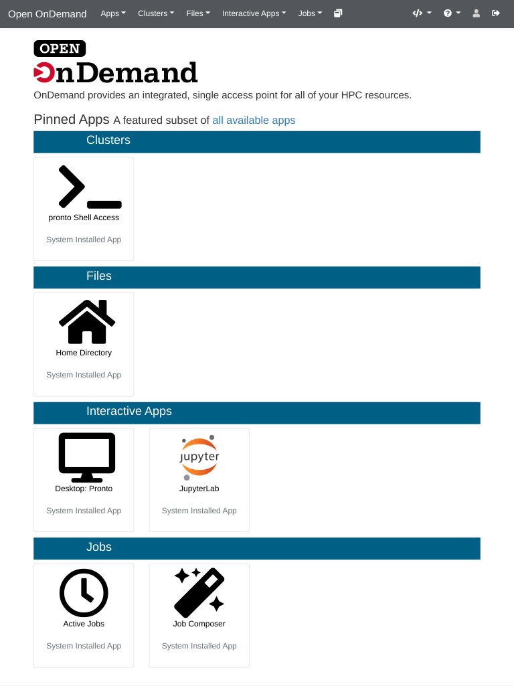

# Open OnDemand

Open OnDemand is a new resource that provides easy access to pronto using your web browser. It is accessible to all pronto users, but considered to be in testing.

Getting Started
---------------

To access Open OnDemand, you must first have a [Pronto lab group account](https://researchit.las.iastate.edu/get-access).

Then visit: [https://ondemand.las.iastate.edu](https://ondemand.las.iastate.edu)

You must be on campus or connected to the VPN for this page to be reachable.

Current Features
----------------

### Interactive Desktop

The Interactive Desktop app provides a graphical user interface that runs as a batch job on pronto. Any module that can be loaded in a normal Pronto batch job can be loaded within the interactive desktop. In addition, the following modules have easy-to-use launcher shortcuts.

* Matlab
* Mathematica
* RStudio

For more information, see this article: [How to use the Interactive Desktop on Open OnDemand](interactive_desktop.md)

### JupyterLab

[JupyterLab](https://jupyter.org/) is a web-based interactive development environment. Our JupyterLab currently supports Python and Julia.

For more information, see this article: [How to use JupyterLab on Open OnDemand](jupyterlab.md)

### File Manager

The file manager provides a simple web interface to upload and download files to pronto. We do not recommend using this for large files. You should use [Globus](../file_transfers/globus.md) instead.

### Shell Access

This app lets you connect to pronto using ssh right from your web browser.

### Active Jobs

This app shows the jobs currently running on pronto.

### Job Composer

The Job Composer app contains templates for launching various types of jobs on pronto.

For more information, see this article: [How to use the Job Composer on Open OnDemand](job_composer.md)