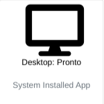
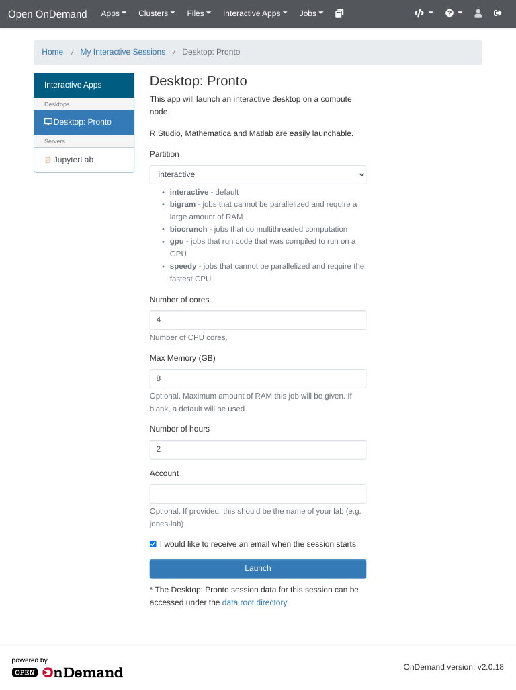
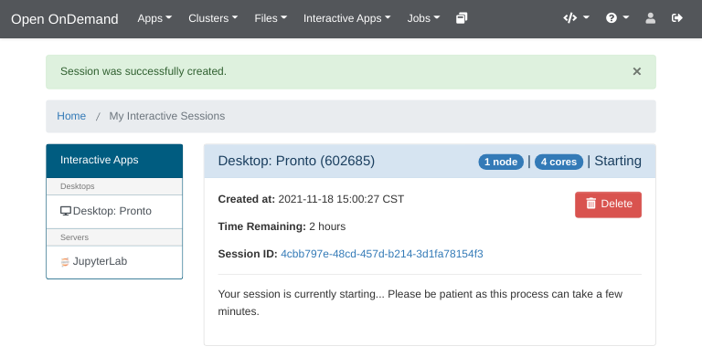
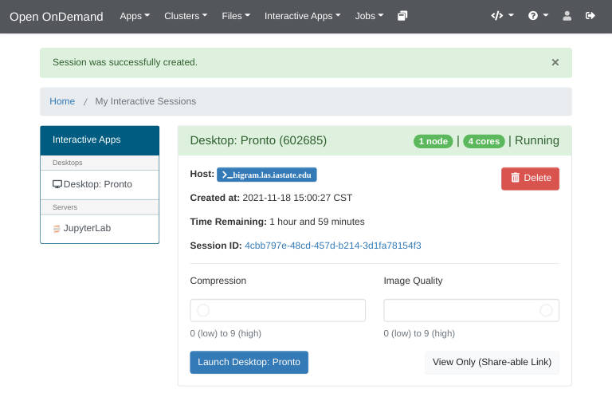
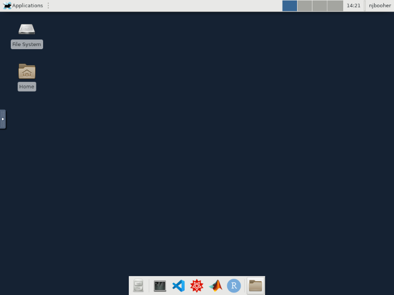
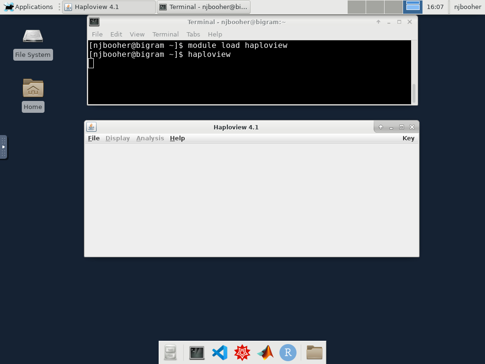

# Interactive Desktop

The Interactive Desktop app provides a graphical user interface that runs as a batch job on pronto. Any module that can be loaded in a normal Pronto batch job can be loaded within the interactive desktop. In addition, the following modules have easy-to-use launcher shortcuts.

*   Matlab
*   Mathematica
*   RStudio

Getting Started
---------------

First, ensure you have followed the directions in the [Open OnDemand](index.md) article to get access to Open OnDemand.

Click the Desktop: Pronto tile on the main OnDemand dashboard.



Fill out the job submission form to specify what resources you want your desktop to have available. When you are finished click the 'Launch' button.



The next screen will look like this. Initially your job will say 'Queued'. Queue times are the same as for any other pronto job.

Once the job has been assigned to a node, it will say 'Starting'. Please be patient as this process can take a few minutes.



When the job is ready, it will say 'Running'. The Compression and Image Quality settings are click-and-drag sliders. If you have a good internet connection, or are on campus, you should set Compression to 0 and Image Quality to 9. Then click the 'Launch Desktop: Pronto' button to connect to the desktop.



The desktop looks like this. To launch any of the preconfigured apps, click the icon for it on the dock at the bottom of the screen. 



When you are finished, please return to the Open OnDemand job list. Click the 'Delete' button next to your job. This will free up resources for other users, reducing queue times.


RStudio
-------

The RStudio installed in the Interactive Desktop uses the same R modules that are available to batch jobs running on pronto. If you launch RStudio using the icons, a recent version of R will be selected for you. RStudio is configured to use separate `R_LIBS_USER` for each user, and for each R module. The libraries are stored in the /work directory of the lab group you ran the interactive job with. This is to avoid issues caused by mixing R libraries built with different compilers.

### Using a specific R module

Open the Terminal app using the icon in the dock. In this terminal, load the R module you want to use. For example:

```bash
module load gcc/10.2.0-zuvaafu
module load r/4.0.4-py3-4khjixy
```

Then start RStudio by running:

```bash
rstudio
```
###  Using your own R library

Open the Terminal app using the icon in the dock. In this terminal, load the R module your R library was created with. For example:

```bash
module load gcc/10.2.0-zuvaafu
module load r/4.0.4-py3-4khjixy
```
Now, set the R_LIBS_USER environment variable to the location you installed the R libraries

```bash
export R_LIBS_USER=/work/LAS/jones-lab/test/Rlibs
```

Then start RStudio by running:

```bash
rstudio
```

Other GUI modules
-----------------

To use other GUI modules within the Interactive Desktop, open the Terminal app and load the module for the GUI program. Then run the command to start the software.

