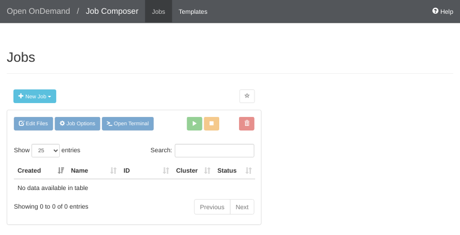
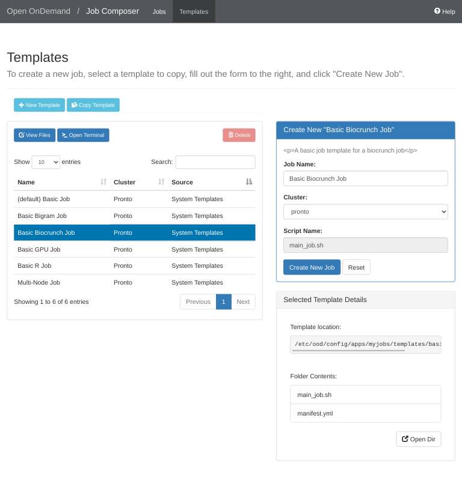
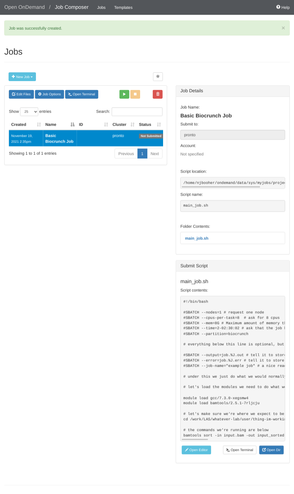
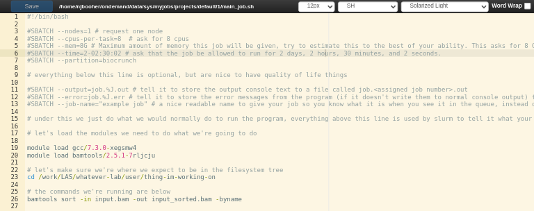
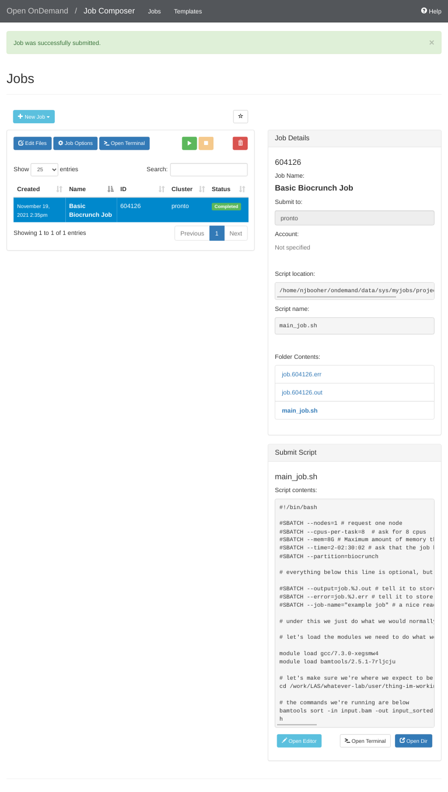

# Job Composer

The Job Composer app allows you to submit jobs to Pronto using several pre-configured templates.

Getting Started
---------------

First, ensure you have followed the directions in the [Open OnDemand](index.md) article to get access to Open OnDemand.

Click the Job Composer tile on the main OnDemand dashboard.

The main job screen looks like this. If this is your first time using it, you will be prompted to follow an interactive tutorial.

After you complete the tutorial, click the 'New Job' button, then click 'From Template' in the popup menu.

On the left you can will see a list of available job templates. For this tutorial, select the Basic Biocrunch Job template. Then, on the right, click the 'Create New Job' button.

On the next screen you can see that a new job has been created from the template and is now available for you to edit. To edit the job template, scroll to the bottom of the page, then click the 'Open Editor' button. A new tab will open in your browser allowing you to edit the job submission file.

In this new tab, edit the job submission file to request the proper resources and add your commands. Then click the blue 'Save' button at the top left. Then close the tab to return to the previous screen.

After closing the tab, you will be returned to the previous screen. Click the green box with the white triangle in it to submit your job. Your job status will change from 'Not Submitted' to 'Queued', and then, once the job has started, to 'Running'. At that point, you can click the job output and error files under the 'Folder Contents' heading to view them. The files will open in a new window. To monitor the job progress, reload the window. When your job is finished, the status in the table row for that job will change to 'Completed'. 

