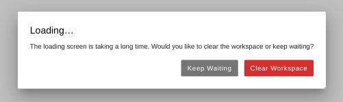
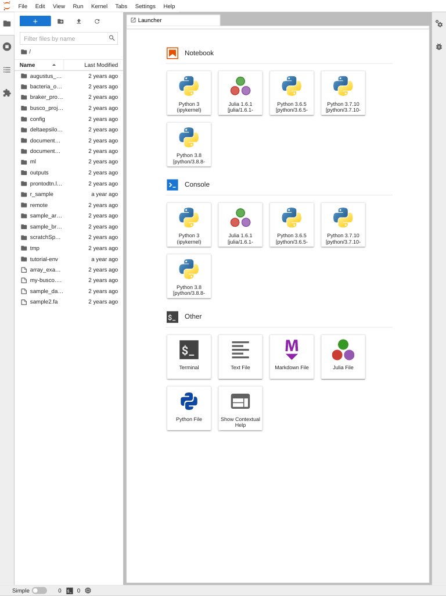

# JupyterLab

[JupyterLab](https://jupyter.org/) is a web-based interactive development environment. Our JupyterLab currently supports Python and Julia.

Getting Started
---------------

First, ensure you have followed the directions in the [Open OnDemand](index.md) article to get access to Open OnDemand.

Click the JupyterLab tile on the main OnDemand dashboard.

Fill out the job submission form to specify what resources you want JupyterLab to have available.

**Note:** If you select the GPU partition, your job will run within the [ml-gpu](../pronto/machine_learning.md) container. The only version of Python available will be the one installed in that container.

When you are finished click the 'Launch' button.

The next screen will look like this. Initially your job will say 'Queued'. Queue times are the same as for any other pronto job.

Once the job has been assigned to a node, it will say 'Starting'. Please be patient as this process can take a few minutes.

When the job is ready, it will say 'Running'. Click the 'Connect to Jupyter' button.

After you click the button, you will probably see a white screen. Eventually, an animated Jupyer icon should show up. This may take several seconds, so please be patient. You may also see an error screen like this.

Select 'Keep Waiting' unless it has been more than 5 minutes.

Once JupyterLab is loaded, you will see something like this:

The pane on the left is the /work directory of the account you ran the job with. To start a Jupyter notebook, select the icon for the Python or Julia version you want to use.

Type some code in the notebook, then hold the Shift key and hit the Return key to execute it. The number next to the code cell will change to an asterisk to indicate that the code is executing. Note that the first time you do this it will take a while because Jupyter needs to create a Python virtual environment and install the IPython kernel in it before the code can run.

When you are finished, please return to the Open OnDemand job list. Click the 'Delete' button next to your job. This will free up resources for other users, reducing queue times.

Installing Additional Python Packages
-------------------------------------

To install additional Python packages, you can run this within the notebook:

> !python -m pip install Biopython

The Python kernels are configured to use separate Python virtual environments for each user, and for each Python module. The libraries are stored in the /work directory of the lab group you ran the interactive job with. This is to avoid issues caused by mixing Python packages installed with different compilers.