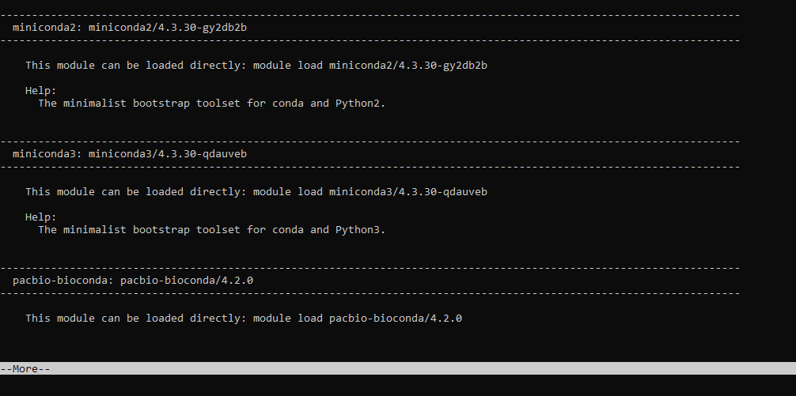

# Setting up a 'conda' environment

### Please note

Use of conda is discouraged. The recommended way to install additional Python packages is with a [Python Virtual Environment](python.md). For other software, we have many [Spack based software modules](spack_modules.md) installed. If you need software that we don't available as a module, but that is already [available as a Spack package](https://spack.readthedocs.io/en/latest/package_list.html), see the [Self Managed Spack Installs](spack_modules.md) section of our guide.

### Proper way to set up a conda environment

To setup a conda environment, you will first need to connect to Pronto. Next, allocate a **compute** node and be sure you are placed on it (via salloc/srun). If you are not familiar with salloc or srun, please refer to [this guide](slurm_basics.md) first. Below is a sample command you could run:

```
$ srun --time=01:00:00 --nodes=1 --cpus-per-task=1 --pty /usr/bin/bash
```

Wait until you have been placed on a **compute** node.

 Now, you will need will need to pick a version of conda that suits your needs. To get a list of available packages, run the command:

```
$ module spider conda
```

This will list the available modules for conda. (The available modules may be subject to change)



Once you have looked through the list of modules, take note of the package name next to the version name. 


Press enter and type in:

```
$ module load <BoxedText>
```

If I wanted to run miniconda3 for example, I would type in

```
$ module load miniconda3/4.3.30-qdauveb
```

The first time you use conda, you need to tell it where to save your environments. Conda defaults to saving environments in your home folder. Home folders on pronto have a quota of 10GB and are not meant for storing software.

To store your conda environments in your work directory, first create a couple directories to hold them:

```
mkdir -p /work/LAS/your-lab/your-directory/.conda/envs
mkdir -p /work/LAS/your-lab/your-directory/.conda/pkgs
```

Next, tell conda to use these directories.

```
conda config --prepend envs_dirs /work/LAS/your-lab/your-directory/.conda/envs
conda config --prepend pkgs_dirs /work/LAS/your-lab/your-directory/.conda/pkgs
```

Now, create your conda environment by running:

```
$ conda create --name <DesiredName> 
```

You will be prompted with a list of additional packages (if you specified any) that will be installed. Type y and hit enter. Wait a few minutes for the package to install. Once they are done installing, run:

```
source activate <NameOfEnvironment>
```

To verify that you have successfully activated the environment, your terminal should look something like:

```
(NameOfEnvironment) [YourNetID@node ~] $
```

A useful cheatsheet for conda can be found here: [https://docs.conda.io/projects/conda/en/4.6.0/\_downloads/52a95608c49671267e40c689e0bc00ca/conda-cheatsheet.pdf](https://docs.conda.io/projects/conda/en/4.6.0/_downloads/52a95608c49671267e40c689e0bc00ca/conda-cheatsheet.pdf)