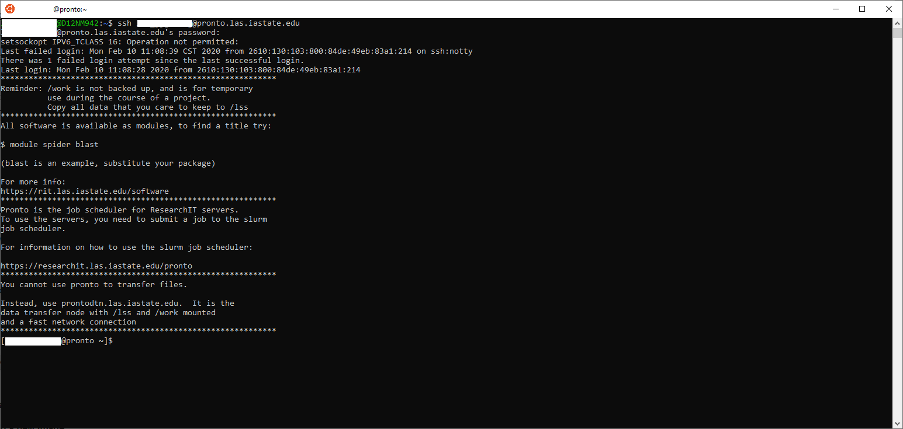

# A General Guide on How to Use Pronto

This guide provides a brief overview of understanding how to utilize Pronto. 

Prerequisites
-------------

*   You should be familiar with the command line and have a basic understanding of how it works. 
    *   Learning how to write a bash script would be extremely helpful. This can save you valuable time without having to retype a sequence of commands multiple times.
    *   There are also plenty of resources online that can help you.
*   Access to Pronto
*   A terminal to type your commands in
    *   For Windows, you can use PuTTY, Powershell, or use the [Windows Subsystem for Linux](https://docs.microsoft.com/en-us/windows/wsl/install-win10).
    *   For Mac, you can use the regular terminal (Under Applications > Utilities > Terminal)
    *   For Linux, you can either search for Terminal or just right click on the desktop and click "Open Terminal"
*   Understanding of software modules
    *   [Spack Modules](spack_modules.md)

Overview
--------

Pronto has plenty of different compute nodes available for your needs. 

[Here's a list of nodes (with hardware specifications) that are available to you](https://researchit.las.iastate.edu/pronto_hardware).

Each compute node has different specifications and is suitable for different workloads.

Please see this guide for [how to pick the best compute node to run your job on](picking_the_best_resource.md). **This is important. Please read it.** 

Logging in and using Pronto
---------------------------

Open up the terminal that you are using and connect to pronto using:

```bash
$ ssh <YourNetIDHere>@pronto.las.iastate.edu
```

If you are using PuTTY, omit the ssh and NetID portion and type in "pronto.las.iastate.edu" in the hostname field. You will be prompted to login and/or enter your password. Please note that when typing your password, no asterisks, letters or spaces will appear. Just type in your password and press enter. This is done to protect your password from people looking over your shoulder.



Your terminal should look similar to the image above after logging in.

You are on the **head** node now. You cannot run any software on the **head** node, so you need to allocate a **compute** node. This is done through SLURM, a workload manager. You will need to utilize SLURM in order to run the jobs that you wish to run. 

**[Please refer to this guide and use it as a reference when you want to allocate compute nodes and run future jobs on the clusters](slurm_basics.md).**

Storage space
-------------

We provide 10GB of home storage for every user on pronto, home should generally not be used for storing data that you'll be working on. For working data you'll want to use the space available in your work directory. When you were granted access to pronto you should have been told where your work directory is, if you are unsure, contact your PI or research IT. **Data on /work is not backed up! It is for temporary use only!**

Allocating a compute node
-------------------------

The best way to run your job would be writing a simple bash script and submitting it via sbatch. You can find a sample script template in the slurm basics guide linked above. You can either upload your own local bash script (see the _Transferring Files_ section below) or create a bash script on the **compute** node with vim, nano, etc. To execute it, run: 

```bash
$ sbatch myscript.sh
```

Note that you can run an sbatch job in the background without being present in front of your computer.

Some **compute** nodes also have local scratch space you can utilize for intensive I/O jobs, you can read more about it [here](using-local-scratch-space-io-intensive-jobs).

The srun command will allocate a **compute** node and be placed on it. This will start an interactive session which is useful for debugging or for programs that require user input. Note that these jobs could potentially be lost if you lose internet connection or if the VPN reconnects. It is recommended you use the [screen command](using-screen-protect-your-process) or tmux (type in "man tmux" in the terminal for more info).

```bash
$ srun --time=01:00:00 --cpus-per-task=1 --partition=interactive --pty /usr/bin/bash
```

If you want to allocate a **compute** node without being placed on it, run:

```bash
$ salloc --time 00:10:00 --nodelist=<NodeNameHere>
```

Note that you will still be on the **head** node. To be placed on the allocated **compute** node, run the srun command mentioned earlier. 

Again, please see the [slurm basics reference](slurm_basics.md) if you want to add more configurations such as allocating a GPU, specific compute node, writing a job script etc. You can run jobs up to 31 days maximum.

Now you are able to run whatever job you wish!

Job Dependencies
----------------

Some software we have available for you require dependencies or packages. You may encounter a "command not found" or an error along those lines. This means you need to load a few modules before running your software. 

For a complete list of all available modules, run the command:

```bash
$ module spider
```

This will list all the available dependencies. 

If you want to see all available versions of a specific dependency, you can run:

```bash
$ module spider <dependency name>
```

Example:

```bash
$ module spider gcc
```

This will list all available versions of gcc. 

Transferring Files
------------------

File transfer to and from the cluster is availble via [Globus](../file_transfers/globus.md).

If you want to use scp or SMB, you will need to use the data transfer node. This node is specifically designed for transferring files across different nodes/clusters quickly and reliably. 

The FQDN (IP Address) you will be using will be:

```bash
prontodtn.las.iastate.edu
```

Login with your NetID and password.

To use scp, you will first need to ssh to prontodtn.las.iastate.edu. You may be prompted for your password twice. You should enter it both times to ensure that you get a Kerberos ticket. If you are not prompted for it a second time, run

```bash
kinit
```

After entering your password, you can disconnect from ssh. scp should then work.

### Guides

*   [How to transfer files using the Linux/Mac terminal.](data-transfer-node-condo)
*   If you are on Windows, you can use WinSCP to transfer files. WinSCP is available on [the software center](how-use-software-center-windows).

Troubleshooting
---------------

Here is a link to a guide that helps you troubleshoot common issues you might encounter:

[Troubleshooting common issues](../troubleshooting/common_issues.md)

Useful Links
------------

If you wish to run a job using R, please refer to [this documentation](/how-run-r-pronto).

Other issues
------------

Please email [researchit@iastate.edu](mailto:researchit@iastate.edu) if you still require assistance.