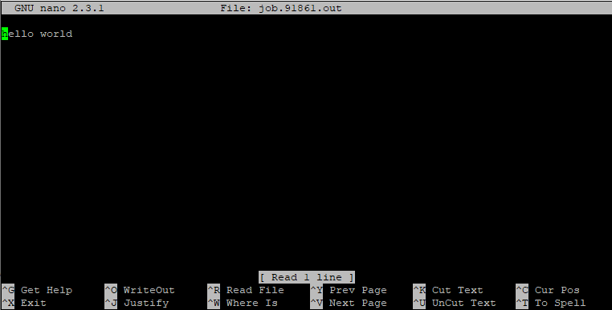

# Machine Learning Singularity Image

In this guide, we will talk about a [Singularity container](https://researchit.las.iastate.edu/singularity) for machine learning workflows and how to submit a batch job that uses it. The machine learning container (ml-gpu) is maintained by ResearchIT and has many machine learning frameworks available.

The singularity recipe that builds this container can be found here: [https://github.com/researchit/singularity-ml](https://github.com/researchit/singularity-ml)

List of Learning Utilities/Frameworks
-------------------------------------

The ResearchIT machine learning container (ml-gpu) includes the following:

*   Python
    *   **ml-gpu/20200210 is the last version to include python 2. Newer versions include python 3.**
    *   TensorFlow
        *   **ml-gpu/20190715 is the last version to include tensorflow 1. Newer versions include tensorflow 2.**
    *   NumPy
    *   Keras
    *   Pillow
    *   Scikit-learn
    *   Pandas
    *   Pandas_ml
    *   Matplotlib
    *   Mxnet
    *   Mlxtend
    *   Tensorboard
    *   Jupyter/JupyterLab
    *   DGL
*   Pytorch
    *   TorchVision
    *   Kineto
    *   Torchaudio
    *   Pytorch_geometric
*   R
    *   TensorFlow
    *   Keras

How to submit a batch file and compile code in the container via GPU node
-------------------------------------------------------------------------

To submit a batch file and/or run code, you will need to use the slurm job manager. If you are unfamiliar with it, you can find the complete documentation [here](slurm_basics.md). Specifically, you will need to know how to run a job and submit the batch file to the node(s) you are using.

Below is a simple example that compiles python code that simply says hello world and saves the output in a .out file: (Part of this was taken from the single node script section linked above)

```
#!/bin/bash
#SBATCH --nodes=1 # request one node
#SBATCH --cpus-per-task=1 # ask for 1 cpu
#SBATCH --mem=8G # Maximum amount of memory this job will be given, try to estimate this to the best of your ability. This asks for 8 GB of ram.
#SBATCH --time=0-00:30:00 # ask that the job be allowed to run for 30 minutes.
#SBATCH --gres=gpu:1 #If you just need one gpu, you're done, if you need more you can change the number
#SBATCH --partition=gpu #specify the gpu partition

# everything below this line is optional, but are nice to have quality of life things
#SBATCH --output=job.%J.out # tell it to store the output console text to a file called job.<assigned job number>.out
#SBATCH --error=job.%J.err # tell it to store the error messages from the program (if it doesn't write them to normal console output) to a file called job.<assigned job muber>.err
#SBATCH --job-name="example job" # a nice readable name to give your job so you know what it is when you see it in the queue, instead of just numbers

# under this we just do what we would normally do to run the program, everything above this line is used by slurm to tell it what your job needs for resources
# let's load the modules we need to do what we're going to do

module load ml-gpu

# let's make sure we're where we expect to be in the filesystem tree (my working directory is specified here)
cd /work/LAS/jones-lab/ml

# the commands we're running are below, this executes my python code
ml-gpu python3 hello.py
```

After submitting this sample script to the slurm job manager, I would end up with a .err and .out file in my directory. If I check my .out file, we can see below that my python code works as intended:



How to install additional Python packages for use in the container
------------------------------------------------------------------

To install additional packages for use in the container, you will need to get an interactive session on a GPU node.

```
srun --time=01:00:00 --nodes=1 --cpus-per-task=4 --partition=gpu --gres=gpu:1 --pty /usr/bin/bash
```

Load the ml-gpu module

```
module load ml-gpu
```

Next, create a directory to install the packages to. This should be within your group's /work directory. Replace the path in the following command and run:

```
ml-gpu python -m venv --system-site-packages /work/LAS/your-lab/mlgpuvenv
```

Now you can install the additional packages with pip.

```
ml-gpu /work/LAS/your-lab/mlgpuvenv/bin/pip3 install somepackage
```

To confirm the packages are installed:

```
ml-gpu /work/LAS/your-lab/mlgpuvenv/bin/pip3 freeze | grep somepackage
```

Your package is now installed.

To use these additional packages in your batch scripts, load the ml-gpu module, then invoke python like this:

```
ml-gpu /work/LAS/your-lab/mlgpuvenv/bin/python your_script.py
```

Be sure to replace the path with the actual location you installed the packages.

How to upgrade Python packages that are already in the container
----------------------------------------------------------------

To use upgraded packages in the container, you will need to get an interactive session on a GPU node.

```
srun --time=01:00:00 --nodes=1 --cpus-per-task=4 --partition=gpu --gres=gpu:1 --pty /usr/bin/bash
```

Load the ml-gpu module

```
module load ml-gpu
```

Next, create a directory to install the upgraded packages to. This should be within your group's /work directory. Replace the path in the following command and run:

```
ml-gpu python -m venv --system-site-packages /work/LAS/your-lab/mlgpuvenv
```

Now you can upgrade the packages with pip.

```
ml-gpu /work/LAS/your-lab/mlgpuvenv/bin/pip3 install --upgrade somepackage
```

To confirm the packages the packages are upgraded:

```
ml-gpu /work/LAS/your-lab/mlgpuvenv/bin/pip3 freeze | grep somepackage
```

Your upgraded package is now installed.

To use these upgraded packages in your batch scripts, load the ml-gpu module, then invoke python like this:

```
ml-gpu /work/LAS/your-lab/mlgpuvenv/bin/python your_script.py
```

Be sure to replace the path with the actual location you installed the packages.

How to create an empty virtual environment in the container
-----------------------------------------------------------

If you need to install a really old version of some package, or make modifications to a package, you can create a completely empty virtual environment in the container. This virtual environment will be isolated from the pre-installed packages and you will need to install everything yourself.

First, get an interactive session on a GPU node.

```
srun --time=01:00:00 --nodes=1 --cpus-per-task=4 --partition=gpu --gres=gpu:1 --pty /usr/bin/bash
```

Load the ml-gpu module

```
module load ml-gpu
```

Next, create a directory to install the packages to. This should be within your group's /work directory. Replace the path in the following command and run:

```
ml-gpu python -m venv /work/LAS/your-lab/emptymlgpuvenv
```

The difference between this command and the one given in previous sections is the removal of the --system-site-packages flag, which isolates the environment.

Now install any packages you need with pip.

```
ml-gpu /work/LAS/your-lab/emptymlgpuvenv/bin/pip3 install somepackage
```

To confirm the packages are installed:

```
ml-gpu /work/LAS/your-lab/emptymlgpuvenv/bin/pip3 freeze | grep somepackage
```

Your package is now installed.

To use this virtual environment in your batch scripts, load the ml-gpu module, then invoke python like this:

```
ml-gpu /work/LAS/your-lab/emptymlgpuvenv/bin/python your_script.py
```

Be sure to replace the path with the actual location you installed the packages.

Note for older versions of the container
----------------------------------------

In older versions of the container you may need to adjust the commands.

The virtual environment functionality might not work. You can achieve similar results by running the following before loading the ml-gpu module:

```
export PYTHONUSERBASE=/work/LAS/your-lab/mlgpupackages
```

Then, instead of 'ml-gpu /work/LAS/your-lab/mlgpuvenv/bin/pip3', try 'ml-gpu python -m pip', 'ml-gpu pip2', or 'ml-gpu pip3'

Then, instead of 'ml-gpu /work/LAS/your-lab/mlgpuvenv/bin/python', try 'ml-gpu python', 'ml-gpu python2', or 'ml-gpu python3'